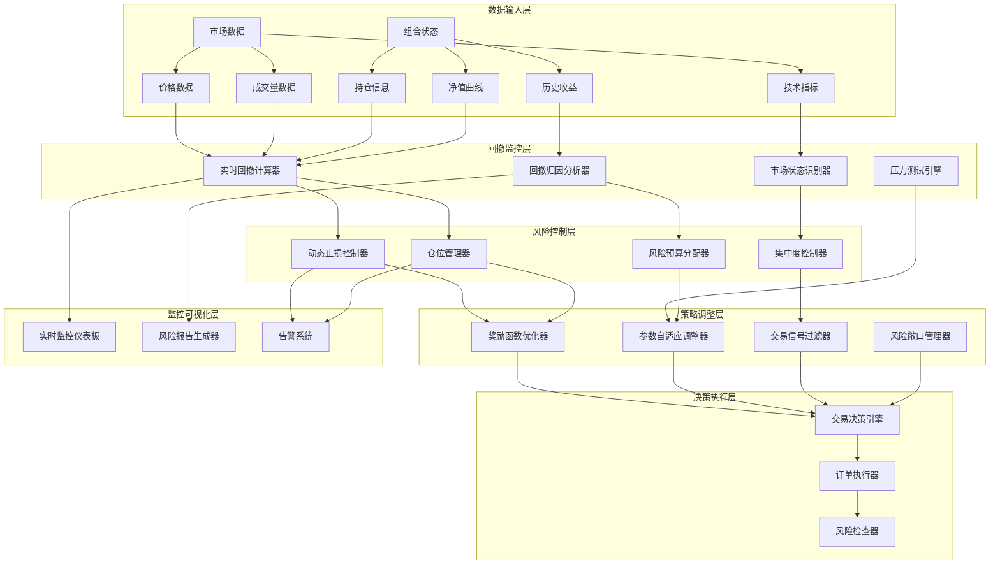
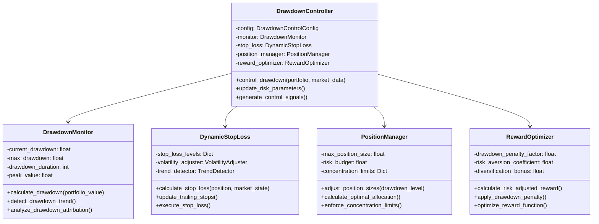

# 回撤控制优化设计文档

## 概述

本设计文档详细描述了回撤控制优化系统的架构和实现方案。该系统旨在通过多层次的风险控制机制，显著降低交易系统的最大回撤，提高风险调整收益。

系统采用分层架构设计，包括实时监控层、风险控制层、策略调整层和可视化层，通过动态参数调整、智能止损、仓位管理和奖励函数优化等手段实现回撤控制目标。

## 架构

### 系统架构图



### 核心组件架构



## 组件和接口

### 1. 回撤监控组件 (DrawdownMonitor)

#### 接口定义
```python
class DrawdownMonitor:
    def calculate_realtime_drawdown(self, portfolio_value: float) -> DrawdownMetrics
    def detect_drawdown_phases(self) -> DrawdownPhase
    def analyze_attribution(self, positions: List[Position]) -> AttributionResult
    def assess_market_regime(self, market_data: MarketData) -> MarketRegime
```

#### 核心功能
- **实时回撤计算**：基于净值曲线实时计算当前回撤水平
- **回撤阶段识别**：识别回撤的开始、持续和恢复阶段
- **归因分析**：分析回撤的主要贡献因子（个股、行业、因子暴露）
- **市场状态识别**：识别牛市、熊市、震荡市等不同市场状态

### 2. 动态止损控制器 (DynamicStopLoss)

#### 接口定义
```python
class DynamicStopLoss:
    def calculate_adaptive_stop_loss(self, position: Position, volatility: float) -> float
    def update_trailing_stops(self, positions: List[Position]) -> Dict[str, float]
    def check_stop_loss_triggers(self, current_prices: Dict[str, float]) -> List[str]
    def execute_stop_loss_orders(self, triggered_symbols: List[str]) -> List[Order]
```

#### 核心功能
- **波动率调整止损**：根据历史波动率动态调整止损阈值
- **追踪止损机制**：在盈利时设置追踪止损，锁定收益
- **趋势感知止损**：结合技术指标判断趋势，调整止损策略
- **组合级止损**：当整体回撤超过阈值时执行组合级止损

### 3. 动态仓位管理器 (PositionManager)

#### 接口定义
```python
class PositionManager:
    def calculate_risk_adjusted_positions(self, drawdown_level: float) -> Dict[str, float]
    def apply_concentration_limits(self, target_positions: Dict[str, float]) -> Dict[str, float]
    def adjust_for_market_regime(self, positions: Dict[str, float], regime: MarketRegime) -> Dict[str, float]
    def optimize_portfolio_allocation(self, expected_returns: np.ndarray, risk_matrix: np.ndarray) -> np.ndarray
```

#### 核心功能
- **风险预算分配**：基于当前回撤水平动态分配风险预算
- **集中度控制**：限制单一资产或行业的最大权重
- **市场适应性调整**：根据市场状态调整整体仓位水平
- **优化配置算法**：使用均值方差优化等方法优化资产配置

### 4. 奖励函数优化器 (RewardOptimizer)

#### 接口定义
```python
class RewardOptimizer:
    def calculate_risk_adjusted_reward(self, returns: float, drawdown: float, volatility: float) -> float
    def apply_drawdown_penalty(self, base_reward: float, drawdown_level: float) -> float
    def add_diversification_bonus(self, reward: float, concentration_score: float) -> float
    def optimize_reward_parameters(self, historical_performance: PerformanceMetrics) -> RewardConfig
```

#### 核心功能
- **回撤惩罚机制**：根据回撤水平施加相应的惩罚
- **风险调整收益**：使用夏普比率、卡尔玛比率等风险调整指标
- **多样化奖励**：鼓励投资组合多样化，减少集中度风险
- **参数自适应优化**：基于历史表现自动调整奖励函数参数

## 数据模型

### 回撤控制配置
```python
@dataclass
class DrawdownControlConfig:
    # 回撤监控参数
    max_drawdown_threshold: float = 0.15        # 最大回撤阈值
    drawdown_warning_threshold: float = 0.08    # 回撤警告阈值
    drawdown_calculation_window: int = 252      # 回撤计算窗口
    
    # 动态止损参数
    base_stop_loss: float = 0.05               # 基础止损阈值
    volatility_multiplier: float = 2.0         # 波动率乘数
    trailing_stop_distance: float = 0.03       # 追踪止损距离
    portfolio_stop_loss: float = 0.12          # 组合级止损
    
    # 仓位管理参数
    max_position_size: float = 0.15            # 最大单一持仓
    min_position_size: float = 0.01            # 最小持仓
    max_sector_exposure: float = 0.30          # 最大行业暴露
    cash_reserve_ratio: float = 0.05           # 现金储备比例
    
    # 风险预算参数
    base_risk_budget: float = 0.10             # 基础风险预算
    risk_scaling_factor: float = 0.5           # 风险缩放因子
    recovery_speed: float = 0.1                # 恢复速度
    
    # 奖励函数参数
    drawdown_penalty_factor: float = 2.0       # 回撤惩罚因子
    risk_aversion_coefficient: float = 0.5     # 风险厌恶系数
    diversification_bonus: float = 0.1         # 多样化奖励
    sharpe_target: float = 1.5                 # 目标夏普比率
```

### 回撤监控指标
```python
@dataclass
class DrawdownMetrics:
    current_drawdown: float                    # 当前回撤
    max_drawdown: float                        # 最大回撤
    drawdown_duration: int                     # 回撤持续天数
    recovery_time: Optional[int]               # 恢复时间
    peak_value: float                          # 峰值净值
    trough_value: float                        # 谷值净值
    underwater_curve: List[float]              # 水下曲线
    drawdown_frequency: float                  # 回撤频率
    average_drawdown: float                    # 平均回撤
```

### 市场状态定义
```python
class MarketRegime(Enum):
    BULL_MARKET = "bull"                       # 牛市
    BEAR_MARKET = "bear"                       # 熊市
    SIDEWAYS_MARKET = "sideways"               # 震荡市
    HIGH_VOLATILITY = "high_vol"               # 高波动期
    LOW_VOLATILITY = "low_vol"                 # 低波动期
    CRISIS = "crisis"                          # 危机期
```

## 错误处理

### 异常类型定义
```python
class DrawdownControlError(Exception):
    """回撤控制相关异常基类"""
    pass

class ExcessiveDrawdownError(DrawdownControlError):
    """过度回撤异常"""
    def __init__(self, current_drawdown: float, threshold: float):
        self.current_drawdown = current_drawdown
        self.threshold = threshold
        super().__init__(f"回撤{current_drawdown:.2%}超过阈值{threshold:.2%}")

class StopLossExecutionError(DrawdownControlError):
    """止损执行异常"""
    pass

class PositionSizingError(DrawdownControlError):
    """仓位计算异常"""
    pass

class RiskBudgetExceededError(DrawdownControlError):
    """风险预算超限异常"""
    pass
```

### 错误处理策略
1. **数据异常处理**：对缺失或异常的市场数据进行插值或过滤
2. **计算异常处理**：对数值计算异常进行边界检查和默认值处理
3. **执行异常处理**：对交易执行失败进行重试和降级处理
4. **系统异常处理**：对系统级异常进行日志记录和告警通知

## 测试策略

### 单元测试
- **回撤计算测试**：验证各种市场情况下回撤计算的准确性
- **止损逻辑测试**：测试不同市场条件下止损触发的正确性
- **仓位管理测试**：验证仓位调整算法的有效性
- **奖励函数测试**：测试奖励函数在不同场景下的表现

### 集成测试
- **端到端回撤控制测试**：测试完整的回撤控制流程
- **多组件协调测试**：验证各组件间的协调工作
- **实时性能测试**：测试系统在实时环境下的响应速度
- **压力测试**：测试系统在极端市场条件下的稳定性

### 回测验证
- **历史数据回测**：使用历史数据验证回撤控制效果
- **蒙特卡洛模拟**：通过随机模拟验证系统鲁棒性
- **对比测试**：与基准策略进行对比分析
- **参数敏感性测试**：测试不同参数设置的影响

### 性能基准
- **回撤改善目标**：最大回撤降低至少30%
- **风险调整收益**：夏普比率提升至少20%
- **响应时间要求**：风险控制决策延迟<100ms
- **系统可用性**：99.9%的系统可用性要求

## 实现细节

### 实时回撤计算算法
```python
def calculate_running_drawdown(self, portfolio_values: List[float]) -> List[float]:
    """计算滚动回撤"""
    drawdowns = []
    running_max = portfolio_values[0]
    
    for value in portfolio_values:
        running_max = max(running_max, value)
        drawdown = (value - running_max) / running_max
        drawdowns.append(drawdown)
    
    return drawdowns
```

### 动态止损阈值计算
```python
def calculate_adaptive_stop_loss(self, position: Position, lookback_days: int = 20) -> float:
    """计算自适应止损阈值"""
    # 计算历史波动率
    returns = self.get_historical_returns(position.symbol, lookback_days)
    volatility = np.std(returns) * np.sqrt(252)
    
    # 基于波动率调整止损
    adaptive_threshold = self.config.base_stop_loss * (1 + volatility * self.config.volatility_multiplier)
    
    # 限制在合理范围内
    return np.clip(adaptive_threshold, 0.02, 0.15)
```

### 风险预算动态调整
```python
def adjust_risk_budget(self, current_drawdown: float) -> float:
    """根据当前回撤调整风险预算"""
    if current_drawdown <= self.config.drawdown_warning_threshold:
        # 低回撤时保持正常风险预算
        return self.config.base_risk_budget
    elif current_drawdown <= self.config.max_drawdown_threshold:
        # 中等回撤时线性降低风险预算
        reduction_factor = (current_drawdown - self.config.drawdown_warning_threshold) / \
                          (self.config.max_drawdown_threshold - self.config.drawdown_warning_threshold)
        return self.config.base_risk_budget * (1 - reduction_factor * self.config.risk_scaling_factor)
    else:
        # 高回撤时大幅降低风险预算
        return self.config.base_risk_budget * (1 - self.config.risk_scaling_factor)
```

### 奖励函数优化
```python
def calculate_risk_adjusted_reward(self, returns: float, drawdown: float, positions: Dict[str, float]) -> float:
    """计算风险调整后的奖励"""
    # 基础收益奖励
    base_reward = returns
    
    # 回撤惩罚
    drawdown_penalty = self.config.drawdown_penalty_factor * abs(drawdown) ** 2
    
    # 多样化奖励
    concentration = self.calculate_concentration_score(positions)
    diversification_bonus = self.config.diversification_bonus * (1 - concentration)
    
    # 综合奖励
    total_reward = base_reward - drawdown_penalty + diversification_bonus
    
    return total_reward
```

## 监控和可视化

### 实时监控指标
- **当前回撤水平**：实时显示当前回撤百分比
- **回撤持续时间**：显示当前回撤持续的天数
- **风险预算使用率**：显示当前风险预算的使用情况
- **止损触发状态**：显示各持仓的止损状态
- **仓位调整历史**：显示仓位调整的历史记录

### 可视化图表
- **回撤曲线图**：显示历史回撤变化趋势
- **水下曲线图**：显示投资组合的水下时间分布
- **风险贡献分解图**：显示各资产对总风险的贡献
- **止损触发热力图**：显示不同资产的止损触发频率
- **仓位变化时序图**：显示仓位随时间的变化情况

### 告警机制
- **回撤预警**：当回撤接近阈值时发送预警
- **止损执行通知**：止损触发时的实时通知
- **风险预算告警**：风险预算使用率过高时的告警
- **系统异常告警**：系统运行异常时的紧急告警