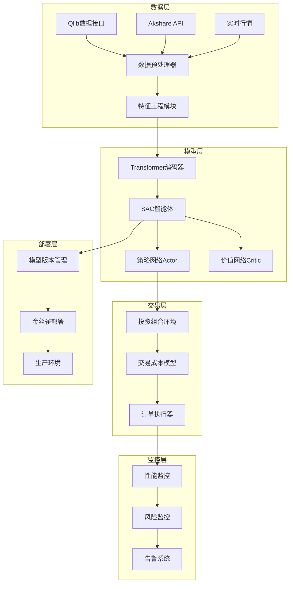

# 基于强化学习与Transformer的A股量化交易智能体设计文档

## 概述

本设计文档基于需求规格，详细描述了一个基于强化学习与Transformer架构的A股量化交易智能体系统的技术实现方案。系统采用模块化设计，支持测试驱动开发，确保代码质量和系统稳定性。

## 架构设计

### 系统整体架构



### 核心组件设计

#### 1. 数据处理组件

**DataCollector（数据收集器）**
- 职责：从多个数据源获取A股市场数据
- 接口：
  - `collect_historical_data(symbols, start_date, end_date) -> pd.DataFrame`
  - `collect_realtime_data(symbols) -> pd.DataFrame`
  - `validate_data(data) -> bool`

**FeatureEngineer（特征工程器）**
- 职责：计算技术指标和基本面因子
- 接口：
  - `calculate_technical_indicators(data) -> pd.DataFrame`
  - `calculate_fundamental_factors(data) -> pd.DataFrame`
  - `normalize_features(features) -> pd.DataFrame`

#### 2. 模型组件

**TimeSeriesTransformer（时序Transformer）**
- 职责：编码时序特征，捕捉长期依赖
- 架构：
  - 输入嵌入层：将原始特征映射到高维空间
  - 位置编码：为序列添加时间位置信息
  - 多层Transformer编码器：捕捉复杂时序模式
  - 时间注意力聚合：将序列信息压缩为固定维度表示

**SACAgent（SAC智能体）**
- 职责：基于状态生成交易决策
- 组件：
  - Actor网络：生成投资组合权重分布
  - Critic网络：评估状态-动作价值
  - 目标网络：稳定训练过程
  - 经验回放缓冲区：存储和采样历史经验

#### 3. 交易环境组件

**PortfolioEnvironment（投资组合环境）**
- 职责：模拟A股交易环境，符合OpenAI Gym规范
- 状态空间：
  - 历史特征窗口：[lookback_window, n_stocks, n_features]
  - 当前持仓：[n_stocks]
  - 市场状态：[market_features]
- 动作空间：目标投资组合权重 [n_stocks]
- 奖励函数：风险调整后收益 = 净收益 - 风险惩罚 - 回撤惩罚

**TransactionCostModel（交易成本模型）**
- 职责：精确计算各项交易成本
- 成本组成：
  - 手续费：双边收取，费率0.1%
  - 印花税：仅卖出收取，费率0.1%
  - 市场冲击：使用Almgren-Chriss模型

## 数据模型

### 核心数据结构

```python
@dataclass
class MarketData:
    """市场数据结构"""
    timestamp: datetime
    symbol: str
    open_price: float
    high_price: float
    low_price: float
    close_price: float
    volume: int
    amount: float
    
@dataclass
class FeatureVector:
    """特征向量结构"""
    timestamp: datetime
    symbol: str
    technical_indicators: Dict[str, float]
    fundamental_factors: Dict[str, float]
    market_microstructure: Dict[str, float]
    
@dataclass
class TradingState:
    """交易状态结构"""
    features: np.ndarray  # [lookback_window, n_stocks, n_features]
    positions: np.ndarray  # [n_stocks]
    market_state: np.ndarray  # [market_features]
    cash: float
    total_value: float
    
@dataclass
class TradingAction:
    """交易动作结构"""
    target_weights: np.ndarray  # [n_stocks]
    confidence: float
    timestamp: datetime
    
@dataclass
class TransactionRecord:
    """交易记录结构"""
    timestamp: datetime
    symbol: str
    action_type: str  # 'buy' or 'sell'
    quantity: int
    price: float
    commission: float
    stamp_tax: float
    slippage: float
    total_cost: float
```

### 数据库设计

**时序数据存储（InfluxDB）**
- market_data：原始市场数据
- features：计算后的特征数据
- portfolio_values：投资组合价值时序
- performance_metrics：绩效指标时序

**关系数据存储（PostgreSQL）**
- trading_sessions：交易会话记录
- model_versions：模型版本信息
- audit_logs：审计日志
- alert_records：告警记录

## 接口设计

### 数据接口

```python
class DataInterface:
    """数据接口抽象类"""
    
    @abstractmethod
    def get_stock_list(self, market: str = 'A') -> List[str]:
        """获取股票列表"""
        pass
    
    @abstractmethod
    def get_price_data(self, symbols: List[str], 
                      start_date: str, end_date: str) -> pd.DataFrame:
        """获取价格数据"""
        pass
    
    @abstractmethod
    def get_fundamental_data(self, symbols: List[str], 
                           start_date: str, end_date: str) -> pd.DataFrame:
        """获取基本面数据"""
        pass

class QlibDataInterface(DataInterface):
    """Qlib数据接口实现"""
    
    def __init__(self, provider_uri: str):
        qlib.init(provider_uri=provider_uri, region='cn')
    
    def get_stock_list(self, market: str = 'A') -> List[str]:
        return D.instruments(market=market)
    
    def get_price_data(self, symbols: List[str], 
                      start_date: str, end_date: str) -> pd.DataFrame:
        fields = ['$open', '$high', '$low', '$close', '$volume', '$amount']
        return D.features(symbols, fields, start_time=start_date, end_time=end_date)
```

### 模型接口

```python
class TradingAgent:
    """交易智能体接口"""
    
    @abstractmethod
    def predict(self, state: TradingState) -> TradingAction:
        """预测交易动作"""
        pass
    
    @abstractmethod
    def train(self, experiences: List[Experience]) -> Dict[str, float]:
        """训练模型"""
        pass
    
    @abstractmethod
    def save_model(self, path: str) -> None:
        """保存模型"""
        pass
    
    @abstractmethod
    def load_model(self, path: str) -> None:
        """加载模型"""
        pass

class SACTradingAgent(TradingAgent):
    """SAC交易智能体实现"""
    
    def __init__(self, config: Dict):
        self.config = config
        self.model = self._build_model()
        self.replay_buffer = ReplayBuffer(config['buffer_size'])
    
    def predict(self, state: TradingState) -> TradingAction:
        with torch.no_grad():
            action, _ = self.model.get_action(state, deterministic=True)
            return TradingAction(
                target_weights=action.cpu().numpy(),
                confidence=self._calculate_confidence(state),
                timestamp=datetime.now()
            )
```

### 监控接口

```python
class MonitoringInterface:
    """监控接口"""
    
    @abstractmethod
    def log_metric(self, name: str, value: float, timestamp: datetime) -> None:
        """记录指标"""
        pass
    
    @abstractmethod
    def check_alert_conditions(self, metrics: Dict[str, float]) -> List[Alert]:
        """检查告警条件"""
        pass
    
    @abstractmethod
    def send_alert(self, alert: Alert) -> None:
        """发送告警"""
        pass

class PrometheusMonitor(MonitoringInterface):
    """Prometheus监控实现"""
    
    def __init__(self):
        self.metrics = self._initialize_metrics()
        start_http_server(8000)
    
    def log_metric(self, name: str, value: float, timestamp: datetime) -> None:
        if name in self.metrics:
            self.metrics[name].set(value)
```

## 组件和接口

### 核心组件详细设计

#### 1. Transformer编码器组件

```python
class TransformerConfig:
    """Transformer配置"""
    d_model: int = 256
    n_heads: int = 8
    n_layers: int = 6
    d_ff: int = 1024
    dropout: float = 0.1
    max_seq_len: int = 252  # 一年交易日
    n_features: int = 50

class TimeSeriesTransformer(nn.Module):
    """时序Transformer编码器"""
    
    def __init__(self, config: TransformerConfig):
        super().__init__()
        self.config = config
        
        # 输入投影层
        self.input_projection = nn.Linear(config.n_features, config.d_model)
        
        # 位置编码
        self.pos_encoding = PositionalEncoding(config.d_model, config.max_seq_len)
        
        # Transformer编码器
        encoder_layer = nn.TransformerEncoderLayer(
            d_model=config.d_model,
            nhead=config.n_heads,
            dim_feedforward=config.d_ff,
            dropout=config.dropout,
            activation='gelu',
            batch_first=True
        )
        self.transformer = nn.TransformerEncoder(encoder_layer, config.n_layers)
        
        # 时间注意力聚合
        self.temporal_attention = TemporalAttention(config.d_model)
    
    def forward(self, x: torch.Tensor, mask: Optional[torch.Tensor] = None) -> torch.Tensor:
        """
        前向传播
        Args:
            x: [batch_size, seq_len, n_stocks, n_features]
            mask: [batch_size, seq_len] 可选的掩码
        Returns:
            encoded: [batch_size, n_stocks, d_model]
        """
        batch_size, seq_len, n_stocks, n_features = x.shape
        
        # 重塑为 [batch_size * n_stocks, seq_len, n_features]
        x = x.view(batch_size * n_stocks, seq_len, n_features)
        
        # 输入投影
        x = self.input_projection(x)
        
        # 添加位置编码
        x = self.pos_encoding(x)
        
        # Transformer编码
        if mask is not None:
            mask = mask.repeat_interleave(n_stocks, dim=0)
        x = self.transformer(x, src_key_padding_mask=mask)
        
        # 时间注意力聚合
        x = self.temporal_attention(x)
        
        # 重塑回 [batch_size, n_stocks, d_model]
        return x.view(batch_size, n_stocks, self.config.d_model)
```

#### 2. SAC智能体组件

```python
class SACConfig:
    """SAC配置"""
    state_dim: int = 256
    action_dim: int = 100  # 股票数量
    hidden_dim: int = 512
    lr_actor: float = 3e-4
    lr_critic: float = 3e-4
    lr_alpha: float = 3e-4
    gamma: float = 0.99
    tau: float = 0.005
    alpha: float = 0.2
    target_entropy: float = -100  # -action_dim

class SACAgent(nn.Module):
    """SAC智能体"""
    
    def __init__(self, config: SACConfig):
        super().__init__()
        self.config = config
        
        # 共享编码器
        self.encoder = TimeSeriesTransformer(TransformerConfig())
        
        # Actor网络
        self.actor = Actor(config.state_dim, config.action_dim, config.hidden_dim)
        
        # Critic网络
        self.critic1 = Critic(config.state_dim, config.action_dim, config.hidden_dim)
        self.critic2 = Critic(config.state_dim, config.action_dim, config.hidden_dim)
        
        # 目标Critic网络
        self.target_critic1 = Critic(config.state_dim, config.action_dim, config.hidden_dim)
        self.target_critic2 = Critic(config.state_dim, config.action_dim, config.hidden_dim)
        
        # 初始化目标网络
        self.target_critic1.load_state_dict(self.critic1.state_dict())
        self.target_critic2.load_state_dict(self.critic2.state_dict())
        
        # 温度参数
        self.log_alpha = nn.Parameter(torch.zeros(1))
        
        # 优化器
        self.actor_optimizer = torch.optim.Adam(self.actor.parameters(), lr=config.lr_actor)
        self.critic_optimizer = torch.optim.Adam(
            list(self.critic1.parameters()) + list(self.critic2.parameters()),
            lr=config.lr_critic
        )
        self.alpha_optimizer = torch.optim.Adam([self.log_alpha], lr=config.lr_alpha)
    
    def get_action(self, state: Dict[str, torch.Tensor], 
                   deterministic: bool = False) -> Tuple[torch.Tensor, torch.Tensor]:
        """获取动作"""
        # 编码特征
        encoded_features = self.encoder(state['features'])
        
        # 构建完整状态
        batch_size = encoded_features.size(0)
        full_state = torch.cat([
            encoded_features.flatten(start_dim=1),
            state['positions'],
            state['market_state']
        ], dim=1)
        
        # 生成动作
        return self.actor(full_state, deterministic)
```

#### 3. 投资组合环境组件

```python
class PortfolioEnvConfig:
    """投资组合环境配置"""
    stock_pool: List[str] = field(default_factory=list)
    lookback_window: int = 60
    initial_cash: float = 1000000.0
    commission_rate: float = 0.001
    stamp_tax_rate: float = 0.001
    risk_aversion: float = 0.1
    max_drawdown_penalty: float = 1.0

class PortfolioEnvironment(gym.Env):
    """投资组合环境"""
    
    def __init__(self, config: PortfolioEnvConfig):
        super().__init__()
        self.config = config
        self.n_stocks = len(config.stock_pool)
        
        # 定义观察空间
        self.observation_space = spaces.Dict({
            'features': spaces.Box(
                low=-np.inf, high=np.inf,
                shape=(config.lookback_window, self.n_stocks, 50),  # 50个特征
                dtype=np.float32
            ),
            'positions': spaces.Box(
                low=0, high=1,
                shape=(self.n_stocks,),
                dtype=np.float32
            ),
            'market_state': spaces.Box(
                low=-np.inf, high=np.inf,
                shape=(10,),  # 10个市场状态特征
                dtype=np.float32
            )
        })
        
        # 定义动作空间
        self.action_space = spaces.Box(
            low=0, high=1,
            shape=(self.n_stocks,),
            dtype=np.float32
        )
        
        # 初始化状态
        self.reset()
    
    def step(self, action: np.ndarray) -> Tuple[Dict, float, bool, Dict]:
        """执行一步交易"""
        # 标准化动作（确保权重和为1）
        target_weights = action / (action.sum() + 1e-8)
        
        # 计算交易成本
        transaction_cost = self._calculate_transaction_cost(
            self.current_positions, target_weights
        )
        
        # 执行交易
        self.current_positions = target_weights.copy()
        
        # 计算收益
        returns = self._get_next_returns()
        portfolio_return = np.dot(self.current_positions, returns)
        
        # 计算奖励
        reward = self._calculate_reward(portfolio_return, transaction_cost, target_weights)
        
        # 更新状态
        self.current_step += 1
        next_observation = self._get_observation()
        done = self.current_step >= self.max_steps
        
        # 信息字典
        info = {
            'portfolio_return': portfolio_return,
            'transaction_cost': transaction_cost,
            'positions': self.current_positions.copy(),
            'total_value': self.total_value
        }
        
        return next_observation, reward, done, info
    
    def _calculate_transaction_cost(self, current_weights: np.ndarray, 
                                  target_weights: np.ndarray) -> float:
        """计算交易成本"""
        trade_weights = np.abs(target_weights - current_weights)
        
        # 手续费
        commission = np.sum(trade_weights) * self.config.commission_rate
        
        # 印花税（仅卖出）
        sell_weights = np.maximum(current_weights - target_weights, 0)
        stamp_tax = np.sum(sell_weights) * self.config.stamp_tax_rate
        
        # 市场冲击（简化模型）
        slippage = np.sum(trade_weights ** 1.5) * 0.001
        
        return commission + stamp_tax + slippage
    
    def _calculate_reward(self, portfolio_return: float, 
                         transaction_cost: float, weights: np.ndarray) -> float:
        """计算奖励"""
        # 净收益
        net_return = portfolio_return - transaction_cost
        
        # 风险惩罚（基于权重集中度）
        concentration = np.sum(weights ** 2)  # Herfindahl指数
        risk_penalty = self.config.risk_aversion * concentration
        
        # 回撤惩罚
        current_drawdown = self._calculate_current_drawdown()
        drawdown_penalty = self.config.max_drawdown_penalty * max(0, current_drawdown - 0.1)
        
        return net_return - risk_penalty - drawdown_penalty
```

## 错误处理

### 异常处理策略

系统采用"快速失败"原则，不捕获异常，而是通过以下方式确保代码健壮性：

1. **输入验证**：在函数入口进行严格的参数验证
2. **类型检查**：使用类型注解和运行时类型检查
3. **边界条件处理**：明确处理边界情况
4. **资源管理**：使用上下文管理器确保资源正确释放

```python
def validate_trading_data(data: pd.DataFrame) -> pd.DataFrame:
    """验证交易数据"""
    # 检查必要列
    required_columns = ['open', 'high', 'low', 'close', 'volume']
    missing_columns = set(required_columns) - set(data.columns)
    if missing_columns:
        raise ValueError(f"缺少必要列: {missing_columns}")
    
    # 检查数据类型
    for col in required_columns:
        if not pd.api.types.is_numeric_dtype(data[col]):
            raise TypeError(f"列 {col} 必须是数值类型")
    
    # 检查数据范围
    if (data['high'] < data['low']).any():
        raise ValueError("最高价不能低于最低价")
    
    if (data['volume'] < 0).any():
        raise ValueError("成交量不能为负数")
    
    return data

def safe_divide(numerator: float, denominator: float, default: float = 0.0) -> float:
    """安全除法"""
    if abs(denominator) < 1e-8:
        return default
    return numerator / denominator
```

## 测试策略

### 测试架构

采用分层测试策略：

1. **单元测试**：测试单个函数和类的功能
2. **集成测试**：测试组件间的交互
3. **端到端测试**：测试完整的交易流程
4. **性能测试**：测试系统性能和资源使用

### 测试工具和框架

- **pytest**：主要测试框架
- **pytest-mock**：模拟外部依赖
- **pytest-cov**：代码覆盖率
- **hypothesis**：属性测试
- **pytest-benchmark**：性能测试

```python
# 示例单元测试
class TestPortfolioEnvironment:
    """投资组合环境测试"""
    
    @pytest.fixture
    def env_config(self):
        return PortfolioEnvConfig(
            stock_pool=['000001.SZ', '000002.SZ'],
            lookback_window=30,
            initial_cash=100000.0
        )
    
    @pytest.fixture
    def portfolio_env(self, env_config):
        return PortfolioEnvironment(env_config)
    
    def test_environment_initialization(self, portfolio_env):
        """测试环境初始化"""
        assert portfolio_env.n_stocks == 2
        assert portfolio_env.config.initial_cash == 100000.0
        assert portfolio_env.observation_space is not None
        assert portfolio_env.action_space is not None
    
    def test_step_function(self, portfolio_env):
        """测试步进函数"""
        action = np.array([0.6, 0.4])
        obs, reward, done, info = portfolio_env.step(action)
        
        assert isinstance(obs, dict)
        assert 'features' in obs
        assert 'positions' in obs
        assert 'market_state' in obs
        assert isinstance(reward, float)
        assert isinstance(done, bool)
        assert isinstance(info, dict)
    
    @pytest.mark.parametrize("weights", [
        np.array([0.5, 0.5]),
        np.array([1.0, 0.0]),
        np.array([0.0, 1.0])
    ])
    def test_different_weight_allocations(self, portfolio_env, weights):
        """测试不同权重分配"""
        obs, reward, done, info = portfolio_env.step(weights)
        assert not np.isnan(reward)
        assert np.allclose(info['positions'].sum(), 1.0, atol=1e-6)
```

这个设计文档提供了系统的详细技术架构，包括核心组件设计、数据模型、接口定义、错误处理策略和测试方法。接下来我将询问您对设计文档的意见。