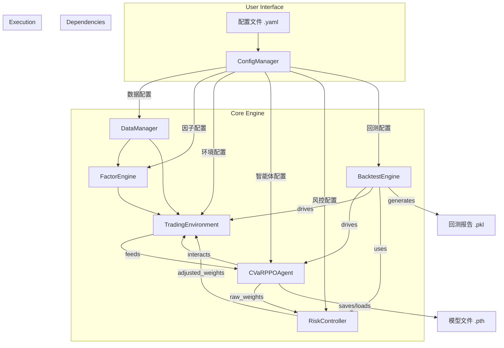

# 系统架构概述

本文档提供了A股强化学习量化交易系统的高层架构设计，旨在帮助开发者和用户理解系统的核心组件、它们之间的相互关系以及数据如何在系统中流动。

## 1. 设计哲学

系统的架构设计遵循以下核心原则：

-   **模块化 (Modularity)**: 系统被划分为一系列高内聚、低耦合的模块（如数据、因子、风控等）。每个模块都有明确的职责，可以独立开发、测试和维护。
-   **配置驱动 (Configuration-Driven)**: 系统的所有行为，从数据源到模型参数再到风险规则，都由外部的YAML配置文件控制，而不是硬编码在代码中。这使得策略的调整和实验变得非常灵活。
-   **分层架构 (Layered Architecture)**: 系统采用经典的分层设计，将数据处理、因子计算、决策逻辑和风险控制清晰地分离开来。
-   **可扩展性 (Extensibility)**: 核心组件（如因子、风险规则）都设计了简单的接口，方便用户进行自定义扩展。

## 2. 核心模块关系图

下图展示了系统核心模块之间的依赖和交互关系。

-   **`ConfigManager`** 是所有模块的起点，为它们提供各自所需的配置。
-   **`DataManager`** 为`FactorEngine`和`TradingEnvironment`提供基础数据。
-   **`FactorEngine`** 为`TradingEnvironment`提供计算好的因子数据。
-   **`TradingEnvironment`** 构成了智能体`CVaRPPOAgent`的“世界”。
-   **`CVaRPPOAgent`** 在环境中学习，并将决策（原始权重）发送给`RiskController`。
-   **`RiskController`** 调整权重后，再交由`TradingEnvironment`执行。
-   **`BacktestEngine`** 负责驱动整个回测流程，并最终生成报告。

## 3. 数据流架构

数据在系统中的处理和转换流程如下，这是一个典型的“数据驱动决策”的流程：

1.  **原始数据层**: `DataManager`从`qlib`数据源获取原始的日线行情数据（开高低收、成交量等）。

2.  **特征工程层**: `FactorEngine`接收原始数据，并将其加工成有意义的**因子（Features）**。例如，通过计算20日价格变化率得到“动量”因子。

3.  **状态表示层**: `TradingEnvironment`将因子数据、当前的持仓状态、宏观经济指标等组合成一个向量，形成强化学习智能体能够理解的**状态（State）**。

4.  **决策层**: `CVaRPPOAgent`接收状态向量，通过其内部的神经网络模型，输出一个代表理想投资组合的**动作（Action）**，即权重向量。

5.  **风险调整层**: `RiskController`接收这个原始的动作，根据一系列规则（如最大回撤、目标波动率）对其进行审查和调整，输出最终的**安全动作（Safe Action）**。

6.  **执行与评估层**: `TradingEnvironment`执行安全动作，计算产生的**收益（Return）**和**奖励（Reward）**。`BacktestEngine`记录这个过程，并最终汇总成绩效报告。

这个清晰的数据流确保了从原始数据到最终决策的每一步都是可追溯和可分析的。

## 4. 技术栈选择

-   **核心语言**: Python 3.8+
-   **数据处理**: `pandas` 和 `numpy`
-   **量化数据基础**: `qlib`
-   **深度学习框架**: `PyTorch`
-   **强化学习环境**: `gymnasium`
-   **配置管理**: `PyYAML`

这样的技术栈选择兼顾了Python在数据科学领域的生态优势和PyTorch在深度学习研究与工业应用中的灵活性与高性能。
