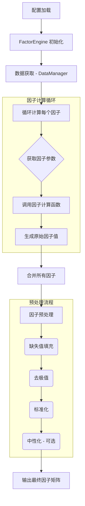

# 因子工程设计

本文档阐述了系统因子工程模块的设计理念、技术实现和未来扩展方向。

## 1. 设计目标

因子工程模块的核心设计目标是：

-   **高效性**: 能够快速地基于海量历史数据计算出上百种因子。
-   **可扩展性**: 提供简洁的接口，方便研究员快速实现、测试和集成新的因子想法。
-   **标准化**: 对所有计算出的因子进行统一的预处理（标准化、去极值、中性化），使其可以直接输入到下游的机器学习模型中。
-   **可配置性**: 允许用户通过配置文件灵活地选择使用哪些因子，并调整它们的计算参数。

## 2. 核心组件

因子工程主要由以下几个组件构成：

-   **`FactorEngine`**: 因子引擎，是整个模块的调度中心。它负责根据配置加载数据、调用相应的因子计算函数、执行预处理流程并返回最终的因子矩阵。
-   **`AlphaFactors` / `RiskFactors`**: 内置的因子库，包含了常用的Alpha因子（如动量、反转、RSI）和风险因子（如波动率、Beta）。
-   **`BaseFactor` (抽象基类)**: 所有自定义因子都必须继承这个基类，它规范了自定义因子的接口。
-   **因子预处理模块**: 一系列可配置的函数，用于对原始因子值进行变换。

## 3. 因子计算流程



## 4. 因子分类体系

系统中的因子主要分为两大类：

### 4.1 Alpha因子
旨在捕捉能够预测未来股票超额收益的信号。我们内置的Alpha因子库主要覆盖以下类别：
-   **动量 (Momentum)**: 基于“强者恒强”的假设，如过去N天的收益率。
-   **反转 (Reversal)**: 基于“物极必反”的假设，如过去N天收益率的负值。
-   **价值 (Value)**: 寻找被市场低估的股票（本系统暂未内置，但可通过自定义扩展加入）。
-   **技术指标 (Technical)**: 如RSI, MACD, 布林带位置等。
-   **量价关系 (Volume-Price)**: 如成交量与价格的相关性。

### 4.2 风险因子
旨在度量资产的风险暴露，用于风险控制和组合优化。
-   **波动率 (Volatility)**: 历史价格波动率。
-   **贝塔 (Beta)**: 股票相对于市场基准的系统性风险。
-   **流动性 (Liquidity)**: 如平均换手率、总市值等。

## 5. 因子预处理

原始因子值（Raw Factors）通常不能直接用于模型训练，需要经过一系列标准化处理。

-   **缺失值填充**: 使用截面均值或行业均值进行填充。
-   **去极值 (Winsorization)**: 将超出特定分位数（如1%和99%）的极端值替换为边界值，以消除异常值对模型的干扰。
-   **标准化 (Standardization)**: 通常使用Z-Score方法，将每个截面（即每个交易日的所有股票）的因子值转换为均值为0、标准差为1的分布。这消除了不同因子量纲差异带来的影响。
-   **中性化 (Neutralization)**: （可选）消除因子对某些其他因素（如行业、市值）的偏好。例如，对一个因子进行市值中性化，可以移除因子收益中由市值大小贡献的部分，得到更纯粹的因子暴露。

## 6. 自定义因子接口 (`BaseFactor`)

为了实现最大的可扩展性，我们设计了`BaseFactor`抽象类。用户只需继承它并实现`compute`方法，就可以将任何复杂的计算逻辑封装成一个即插即用的因子模块。

```python
class MyFactor(BaseFactor):
    def __init__(self, param1, param2):
        # 接收参数
        self.p1 = param1
        self.p2 = param2

    def compute(self, data):
        # data是包含开高低收等数据的DataFrame
        # ... 实现复杂的计算逻辑 ...
        return final_factor_series
```

这种设计使得研究员可以专注于因子逻辑本身，而无需关心数据对齐、预处理等工程细节。
