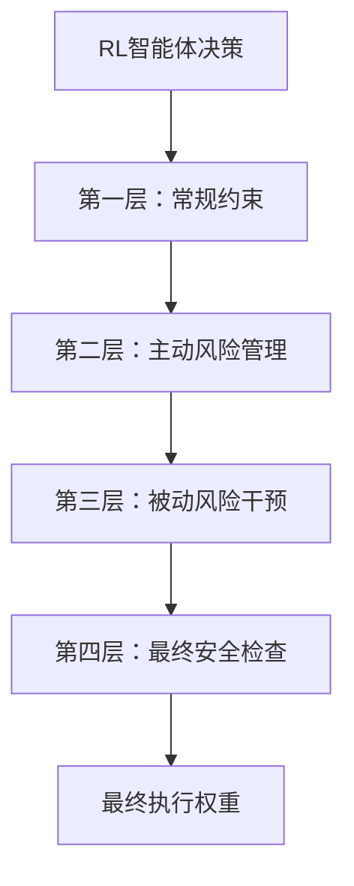

# 风险控制设计

本文档详细阐述了系统多层风险控制框架的设计理念和实现机制。风险控制是本系统的核心，其优先级高于收益追求。

## 1. 设计理念：多层防御 (Defense in Depth)

我们不依赖单一的风险控制方法，而是构建了一个多层次、多角度的纵深防御体系。每一层风险控制都有不同的目标和触发条件，从日常的波动管理到极端的止损保护，层层设防。

## 2. 风险控制层次详解

### 第一层：常规约束 (Basic Constraints)
-   **目标**: 确保投资组合始终符合最基本的合规和分散化要求。
-   **实现**: 
    -   **单票最大仓位 (`max_position`)**: 限制任何单只股票的权重，防止过度集中在个别股票上。
    -   **总杠杆限制 (`max_leverage`)**: 控制组合的总风险暴露。
-   **触发时机**: 每次交易决策后，最先执行。

### 第二层：主动风险管理 (Proactive Risk Management)
-   **目标**: 根据对市场状态的判断，主动调整风险暴露，试图“避开”潜在的危险。
-   **实现**: 
    -   **`DynamicLowVolFilter` (动态低波筛选器)**: 这是本层的核心。它通过分析市场整体波动率，将市场划分为“高波”、“中波”、“低波”三种制度。
        -   在高波动制度下，它会筛选出一个波动较小的“安全股票池”，并强制模型只能在这些股票中交易。
        -   它还会动态调整下一层的目标波动率，在市场动荡时自动降低风险偏好。
-   **触发时机**: 在常规约束之后，基于对市场制度的判断执行。

### 第三层：被动风险干预 (Passive Risk Intervention)
-   **目标**: 当风险事件已经发生（如净值回撤），被动地进行干预，防止亏损进一步扩大。
-   **实现**: 
    -   **`TargetVolatilityController` (目标波动率控制)**: 它的主要职责是调整组合杠杆，使组合的已实现波动率与目标波动率（由第二层动态设定）相匹配。这是一个持续的、平滑的调整过程。
    -   **`DynamicStopLoss` (动态止损)**: 这是更强力的干预手段。当组合净值从高点回撤超过预设阈值（如15%）时，会触发全局止损，强制大幅降低总仓位。
-   **触发时机**: 在主动管理之后，基于投资组合自身的表现进行干预。

### 第四层：最终安全检查 (Final Safety Check)
-   **目标**: 作为最后一道防线，捕获任何在前几层可能被遗漏的极端风险场景。
-   **实现**: 包含一些硬编码的规则，例如：“如果组合的日内VaR超过某个绝对阈值，则不允许开新仓”。
-   **触发时机**: 在所有其他风险调整之后，执行交易之前。

## 3. 核心组件交互

-   **`RiskController`** 是所有风险模块的统一调度器。它按照预设的顺序依次调用各个子模块。
-   **`DynamicLowVolFilter`** 的输出（市场制度、目标波动率、可交易股票池）会作为输入传递给`TargetVolatilityController`和其他模块，实现了风险模块之间的信息联动。
-   所有风险参数（如止损阈值、目标波动率等）都通过**`ConfigManager`**进行配置，方便用户根据自己的风险偏好进行调整。

## 4. 可扩展性

该分层设计具有良好的可扩展性。用户可以：
-   在`RiskController`中添加新的风险控制层。
-   创建新的风险控制子模块（如基于VIX指数的恐慌性减仓模块），并将其插入到`process_weights`流程中。
-   调整各层次的执行顺序，以实现不同的风险管理策略。

通过这种设计，本系统构建了一个既稳健又灵活的风险管理框架，能够有效地平衡智能体决策的探索性与金融投资的审慎性要求。
