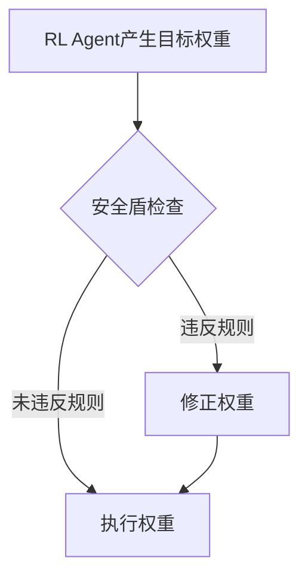

# 强化学习算法设计

本文档详细阐述了本系统核心的强化学习算法设计，主要包括CVaR-PPO算法、状态-动作-奖励空间设计以及安全约束机制。

## 1. 核心算法：CVaR-PPO

为了在追求收益的同时严格控制极端市场条件下的尾部风险，我们没有采用标准的PPO (Proximal Policy Optimization) 算法，而是设计并实现了**条件风险价值约束的PPO (CVaR-PPO)**。

### 1.1 为什么选择CVaR-PPO？

-   **风险敏感性**: 传统的期望收益最大化目标函数对罕见但影响巨大的亏损不敏感。CVaR (Conditional Value at Risk) 专注于收益分布的尾部，能更好地度量和管理极端风险。
-   **策略稳定性**: PPO通过信任域约束保证了策略更新的稳定性，避免了策略在训练过程中发生灾难性崩溃，这在金融场景中至关重要。
-   **结合优势**: CVaR-PPO将PPO的稳定性与CVaR的风险控制能力相结合，形成一个既能稳健学习又能有效规避风险的决策引擎。

### 1.2 算法原理

CVaR-PPO的目标函数在标准PPO的基础上增加了一个CVaR约束项：

**最大化** E[At]  
**约束于** CVaR_α(R) ≤ -L

其中:
- `E[At]` 是策略的期望优势函数（与PPO相同）。
- `CVaR_α(R)` 是在置信水平α下，投资组合收益R的条件风险价值。
- `-L` 是预设的最大可接受CVaR损失。

我们通过拉格朗日乘子法将这个约束优化问题转化为无约束问题，并将其整合到PPO的损失函数中。

## 2. 状态空间 (State Space)

状态空间是智能体观察到的环境信息，必须全面且高效地反映市场状态。

-   **市场宏观特征**:
    -   大盘指数的波动率、趋势指标等。
-   **个体股票特征**:
    -   **技术指标**: 移动平均线 (MA), 相对强弱指数 (RSI), 布林带等。
    -   **风险指标**: 个股历史波动率、与大盘的相关性 (Beta) 等。
    -   **因子特征**: 由因子引擎计算出的Alpha因子和风险因子值。
-   **投资组合状态**:
    -   当前持仓比例。
    -   已实现盈亏。
    -   账户净值。

## 3. 动作空间 (Action Space)

动作空间定义了智能体可以执行的操作。我们设计为**调整目标持仓权重**。

-   **类型**: 连续动作空间。
-   **维度**: N (股票池中的股票数量)。
-   **定义**: 智能体的输出是一个N维向量，代表下一周期的目标持仓权重。
-   **约束**:
    -   所有权重之和为1 (全投资)。
    -   单个权重大于等于0 (禁止做空)。
    -   权重经过Softmax函数归一化。

## 4. 奖励函数 (Reward Function)

奖励函数引导智能体的学习方向，必须仔细设计以平衡收益和风险。

`Reward = PortfolioReturn - λ * RiskPenalty`

-   **PortfolioReturn**: 投资组合的周期对数收益率。
-   **RiskPenalty**: 风险惩罚项，可以包括：
    -   **波动率惩罚**: `(PortfolioVolatility - TargetVolatility)^2`
    -   **最大回撤惩罚**: `max(0, CurrentDrawdown - MaxAcceptableDrawdown)`
    -   **交易成本惩罚**: `TransactionCost`
-   **λ**: 风险厌恶系数，是一个可调节的超参数，用于平衡收益和风险的重要性。

## 5. 安全约束机制 (Safety Shield)

即使有CVaR-PPO，强化学习的探索性质仍可能导致一些意料之外的风险行为。因此，我们引入了**安全盾 (Safety Shield)**，作为决策的最后一道防线。

安全盾在智能体产生目标持仓权重后、实际执行交易前进行干预。

### 安全盾规则示例：

1.  **最大持仓限制**: 任何单只股票的持仓权重不得超过 `max_single_stock_weight` (例如5%)。
2.  **行业分散化**: 任何单一行业的总持仓权重不得超过 `max_industry_weight` (例如20%)。
3.  **交易频率限制**: 如果最近交易过于频繁，则强制进入冷静期，不允许开新仓。
4.  **止损规则**: 如果某只股票触发了预设的止损线，则强制清仓。

这些规则是基于领域知识的硬约束，确保了即使在模型学习不充分或市场出现极端情况时，系统的行为依然在可控范围内。
