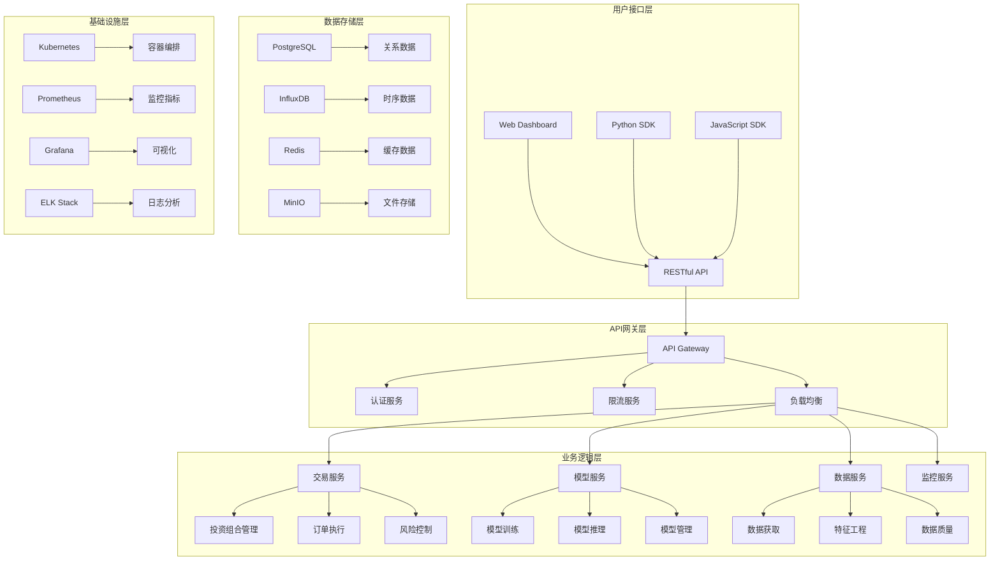
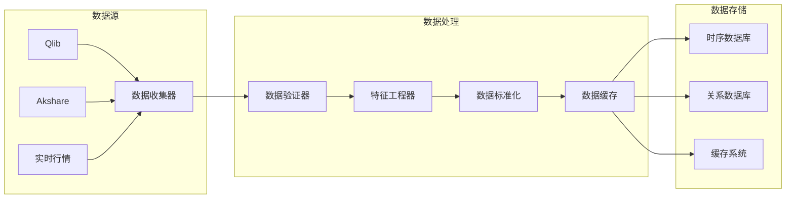
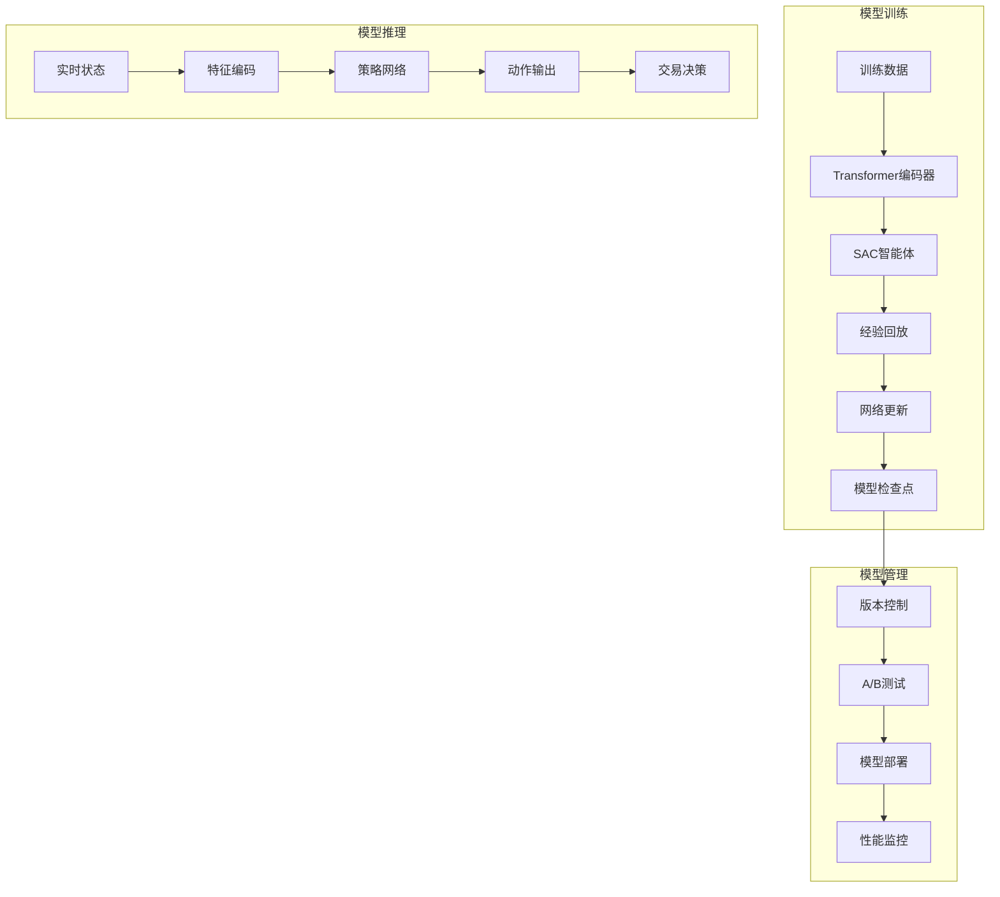
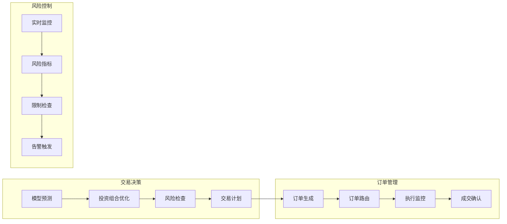
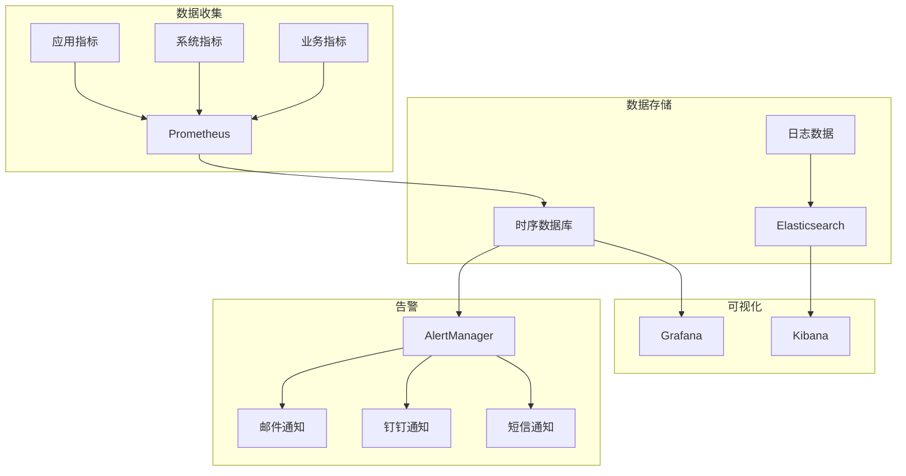
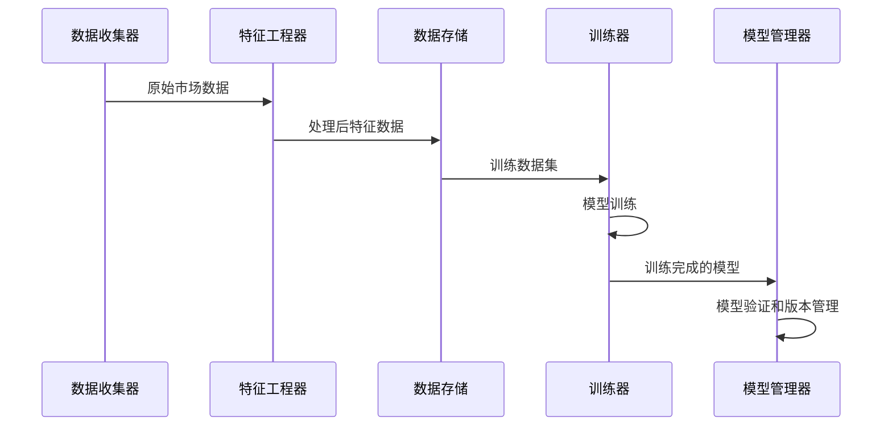
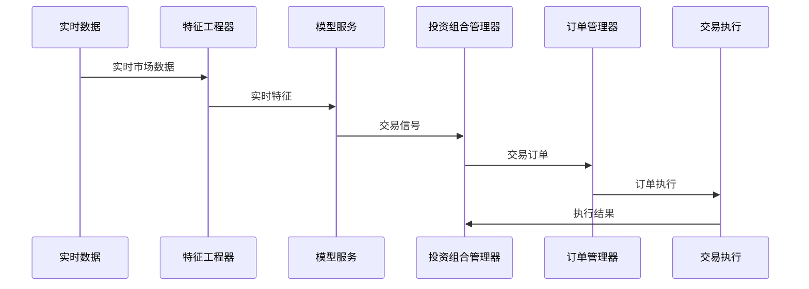
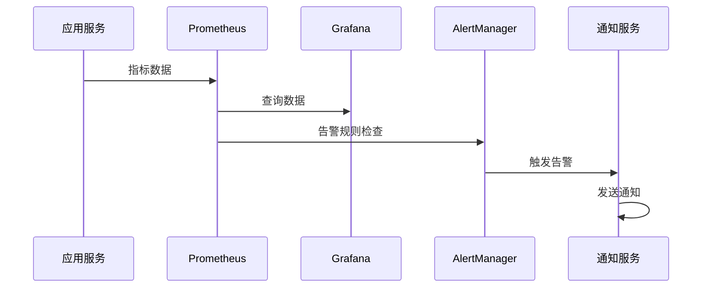
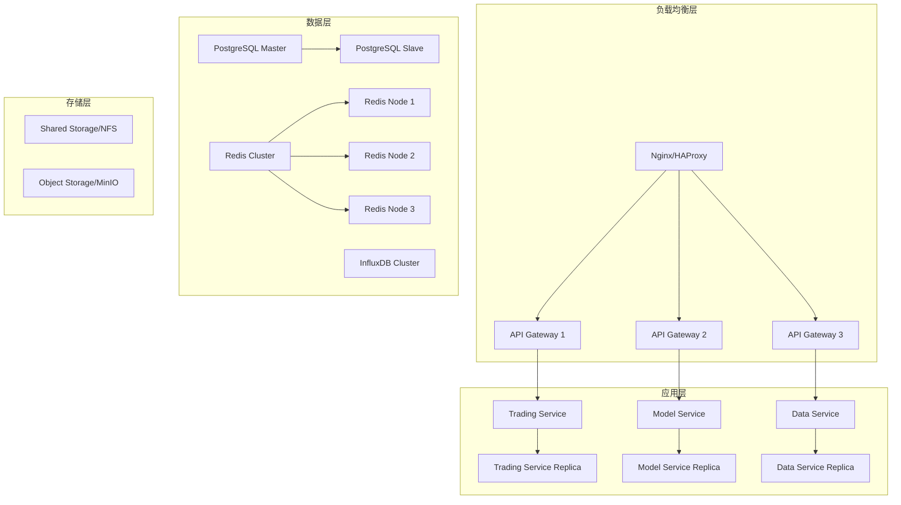
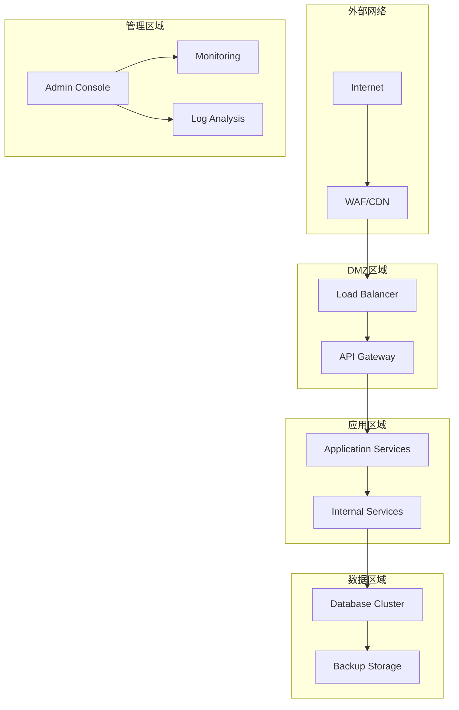

# 系统架构文档

## 概述

本文档详细描述了基于强化学习与Transformer的A股量化交易智能体系统的技术架构，包括系统设计原则、核心组件、数据流和部署架构。

## 设计原则

### 1. 模块化设计
- **单一职责原则**: 每个模块专注于特定功能
- **松耦合**: 模块间通过标准接口通信
- **高内聚**: 相关功能集中在同一模块内
- **可扩展性**: 支持新功能的快速集成

### 2. 可靠性设计
- **容错机制**: 系统能够处理各种异常情况
- **数据一致性**: 确保交易数据的准确性和完整性
- **故障恢复**: 支持快速故障检测和恢复
- **监控告警**: 全面的系统监控和实时告警

### 3. 性能优化
- **异步处理**: 使用异步编程提高并发性能
- **缓存策略**: 多层缓存减少数据访问延迟
- **批处理**: 批量处理提高数据处理效率
- **资源管理**: 优化内存和计算资源使用

### 4. 安全性设计
- **数据加密**: 敏感数据加密存储和传输
- **访问控制**: 基于角色的权限管理
- **审计日志**: 完整的操作审计记录
- **合规性**: 满足金融监管要求

## 系统整体架构



## 核心组件架构

### 1. 数据处理组件



**核心类设计**:

```python
class DataCollector:
    """数据收集器"""
    def __init__(self, config: DataConfig):
        self.qlib_interface = QlibDataInterface(config.qlib)
        self.akshare_interface = AkshareDataInterface(config.akshare)
        self.validator = DataValidator()
        self.cache = DataCache(config.cache)
    
    async def collect_market_data(self, symbols: List[str], 
                                 start_date: str, end_date: str) -> pd.DataFrame:
        """收集市场数据"""
        pass
    
    async def collect_realtime_data(self, symbols: List[str]) -> pd.DataFrame:
        """收集实时数据"""
        pass

class FeatureEngineer:
    """特征工程器"""
    def __init__(self, config: FeatureConfig):
        self.technical_calculator = TechnicalIndicatorCalculator()
        self.fundamental_calculator = FundamentalFactorCalculator()
        self.normalizer = FeatureNormalizer()
    
    def calculate_features(self, data: pd.DataFrame) -> pd.DataFrame:
        """计算特征"""
        pass
    
    def normalize_features(self, features: pd.DataFrame) -> pd.DataFrame:
        """标准化特征"""
        pass
```

### 2. 模型组件架构



**核心类设计**:

```python
class TimeSeriesTransformer(nn.Module):
    """时序Transformer编码器"""
    def __init__(self, config: TransformerConfig):
        super().__init__()
        self.config = config
        self.input_projection = nn.Linear(config.n_features, config.d_model)
        self.pos_encoding = PositionalEncoding(config.d_model, config.max_seq_len)
        self.transformer = nn.TransformerEncoder(
            nn.TransformerEncoderLayer(
                d_model=config.d_model,
                nhead=config.n_heads,
                dim_feedforward=config.d_ff,
                dropout=config.dropout,
                batch_first=True
            ),
            num_layers=config.n_layers
        )
        self.temporal_attention = TemporalAttention(config.d_model)
    
    def forward(self, x: torch.Tensor) -> torch.Tensor:
        """前向传播"""
        pass

class SACAgent(nn.Module):
    """SAC智能体"""
    def __init__(self, config: SACConfig):
        super().__init__()
        self.encoder = TimeSeriesTransformer(config.transformer)
        self.actor = Actor(config.state_dim, config.action_dim, config.hidden_dim)
        self.critic1 = Critic(config.state_dim, config.action_dim, config.hidden_dim)
        self.critic2 = Critic(config.state_dim, config.action_dim, config.hidden_dim)
        self.target_critic1 = deepcopy(self.critic1)
        self.target_critic2 = deepcopy(self.critic2)
        self.replay_buffer = ReplayBuffer(config.buffer_size)
    
    def get_action(self, state: Dict[str, torch.Tensor]) -> Tuple[torch.Tensor, torch.Tensor]:
        """获取动作"""
        pass
    
    def update(self, batch: Dict[str, torch.Tensor]) -> Dict[str, float]:
        """更新网络参数"""
        pass
```

### 3. 交易执行组件架构



**核心类设计**:

```python
class PortfolioManager:
    """投资组合管理器"""
    def __init__(self, config: PortfolioConfig):
        self.risk_controller = RiskController(config.risk)
        self.transaction_cost_model = TransactionCostModel(config.cost)
        self.order_manager = OrderManager(config.order)
    
    async def rebalance(self, target_weights: Dict[str, float]) -> RebalancePlan:
        """重新平衡投资组合"""
        pass
    
    async def execute_trades(self, trades: List[Trade]) -> List[ExecutionResult]:
        """执行交易"""
        pass

class RiskController:
    """风险控制器"""
    def __init__(self, config: RiskConfig):
        self.limits = config.limits
        self.metrics_calculator = RiskMetricsCalculator()
        self.alert_system = AlertSystem(config.alerts)
    
    def check_risk_limits(self, portfolio: Portfolio, 
                         proposed_trades: List[Trade]) -> RiskCheckResult:
        """检查风险限制"""
        pass
    
    def calculate_risk_metrics(self, portfolio: Portfolio) -> RiskMetrics:
        """计算风险指标"""
        pass
```

### 4. 监控系统架构



## 数据流架构

### 1. 训练数据流



### 2. 实时推理数据流



### 3. 监控数据流



## 部署架构

### 1. 容器化部署

```yaml
# docker-compose.yml
version: '3.8'
services:
  api-gateway:
    image: trading-system/api-gateway:latest
    ports:
      - "8000:8000"
    environment:
      - REDIS_URL=redis://redis:6379
      - POSTGRES_URL=postgresql://postgres:5432/trading
    depends_on:
      - redis
      - postgres
  
  model-service:
    image: trading-system/model-service:latest
    environment:
      - MODEL_PATH=/models
      - GPU_ENABLED=true
    volumes:
      - ./models:/models
    deploy:
      resources:
        reservations:
          devices:
            - driver: nvidia
              count: 1
              capabilities: [gpu]
  
  trading-service:
    image: trading-system/trading-service:latest
    environment:
      - POSTGRES_URL=postgresql://postgres:5432/trading
      - REDIS_URL=redis://redis:6379
    depends_on:
      - postgres
      - redis
  
  data-service:
    image: trading-system/data-service:latest
    environment:
      - INFLUXDB_URL=http://influxdb:8086
      - QLIB_DATA_PATH=/data/qlib
    volumes:
      - ./data:/data
  
  postgres:
    image: postgres:13
    environment:
      - POSTGRES_DB=trading
      - POSTGRES_USER=trading_user
      - POSTGRES_PASSWORD=trading_password
    volumes:
      - postgres_data:/var/lib/postgresql/data
  
  redis:
    image: redis:6-alpine
    volumes:
      - redis_data:/data
  
  influxdb:
    image: influxdb:2.0
    environment:
      - INFLUXDB_DB=trading
      - INFLUXDB_ADMIN_USER=admin
      - INFLUXDB_ADMIN_PASSWORD=admin_password
    volumes:
      - influxdb_data:/var/lib/influxdb2
  
  prometheus:
    image: prom/prometheus:latest
    ports:
      - "9090:9090"
    volumes:
      - ./monitoring/prometheus.yml:/etc/prometheus/prometheus.yml
      - prometheus_data:/prometheus
  
  grafana:
    image: grafana/grafana:latest
    ports:
      - "3000:3000"
    environment:
      - GF_SECURITY_ADMIN_PASSWORD=admin
    volumes:
      - grafana_data:/var/lib/grafana

volumes:
  postgres_data:
  redis_data:
  influxdb_data:
  prometheus_data:
  grafana_data:
```

### 2. Kubernetes部署

```yaml
# k8s/deployment.yaml
apiVersion: apps/v1
kind: Deployment
metadata:
  name: trading-system-api
  namespace: trading
spec:
  replicas: 3
  selector:
    matchLabels:
      app: trading-system-api
  template:
    metadata:
      labels:
        app: trading-system-api
    spec:
      containers:
      - name: api
        image: trading-system/api:latest
        ports:
        - containerPort: 8000
        env:
        - name: POSTGRES_URL
          valueFrom:
            secretKeyRef:
              name: database-secret
              key: postgres-url
        - name: REDIS_URL
          valueFrom:
            configMapKeyRef:
              name: app-config
              key: redis-url
        resources:
          requests:
            memory: "512Mi"
            cpu: "500m"
          limits:
            memory: "1Gi"
            cpu: "1000m"
        livenessProbe:
          httpGet:
            path: /health
            port: 8000
          initialDelaySeconds: 30
          periodSeconds: 10
        readinessProbe:
          httpGet:
            path: /ready
            port: 8000
          initialDelaySeconds: 5
          periodSeconds: 5

---
apiVersion: v1
kind: Service
metadata:
  name: trading-system-api-service
  namespace: trading
spec:
  selector:
    app: trading-system-api
  ports:
  - protocol: TCP
    port: 80
    targetPort: 8000
  type: ClusterIP

---
apiVersion: networking.k8s.io/v1
kind: Ingress
metadata:
  name: trading-system-ingress
  namespace: trading
  annotations:
    kubernetes.io/ingress.class: nginx
    cert-manager.io/cluster-issuer: letsencrypt-prod
spec:
  tls:
  - hosts:
    - api.trading-system.com
    secretName: trading-system-tls
  rules:
  - host: api.trading-system.com
    http:
      paths:
      - path: /
        pathType: Prefix
        backend:
          service:
            name: trading-system-api-service
            port:
              number: 80
```

### 3. 高可用架构



## 安全架构

### 1. 网络安全



### 2. 数据安全

- **传输加密**: 所有网络通信使用TLS 1.3加密
- **存储加密**: 敏感数据使用AES-256加密存储
- **密钥管理**: 使用HashiCorp Vault管理加密密钥
- **访问控制**: 基于RBAC的细粒度权限控制

### 3. 应用安全

```python
# 安全配置示例
SECURITY_CONFIG = {
    'authentication': {
        'jwt_secret_key': os.getenv('JWT_SECRET_KEY'),
        'jwt_expiration': 3600,  # 1小时
        'refresh_token_expiration': 86400 * 7,  # 7天
    },
    'authorization': {
        'rbac_enabled': True,
        'default_role': 'viewer',
        'admin_roles': ['admin', 'super_admin'],
    },
    'rate_limiting': {
        'default_limit': '100/minute',
        'auth_limit': '10/minute',
        'api_limit': '1000/hour',
    },
    'encryption': {
        'algorithm': 'AES-256-GCM',
        'key_rotation_days': 90,
    },
    'audit': {
        'log_all_requests': True,
        'log_sensitive_data': False,
        'retention_days': 1825,  # 5年
    }
}
```

## 性能优化

### 1. 缓存策略

```python
# 多层缓存架构
class CacheManager:
    def __init__(self):
        self.l1_cache = LRUCache(maxsize=1000)  # 内存缓存
        self.l2_cache = RedisCache()  # 分布式缓存
        self.l3_cache = DatabaseCache()  # 数据库缓存
    
    async def get(self, key: str) -> Any:
        # L1缓存
        if key in self.l1_cache:
            return self.l1_cache[key]
        
        # L2缓存
        value = await self.l2_cache.get(key)
        if value:
            self.l1_cache[key] = value
            return value
        
        # L3缓存/数据库
        value = await self.l3_cache.get(key)
        if value:
            await self.l2_cache.set(key, value, ttl=3600)
            self.l1_cache[key] = value
        
        return value
```

### 2. 异步处理

```python
# 异步任务处理
class AsyncTaskManager:
    def __init__(self):
        self.task_queue = asyncio.Queue()
        self.workers = []
    
    async def start_workers(self, num_workers: int = 4):
        """启动工作进程"""
        for i in range(num_workers):
            worker = asyncio.create_task(self._worker(f"worker-{i}"))
            self.workers.append(worker)
    
    async def _worker(self, name: str):
        """工作进程"""
        while True:
            task = await self.task_queue.get()
            try:
                await task.execute()
            except Exception as e:
                logger.error(f"Worker {name} failed to execute task: {e}")
            finally:
                self.task_queue.task_done()
    
    async def submit_task(self, task: Task):
        """提交任务"""
        await self.task_queue.put(task)
```

### 3. 数据库优化

```sql
-- 索引优化
CREATE INDEX CONCURRENTLY idx_market_data_symbol_timestamp 
ON market_data (symbol, timestamp DESC);

CREATE INDEX CONCURRENTLY idx_trading_sessions_status 
ON trading_sessions (status) WHERE status IN ('active', 'running');

-- 分区表
CREATE TABLE market_data_2024 PARTITION OF market_data
FOR VALUES FROM ('2024-01-01') TO ('2025-01-01');

-- 物化视图
CREATE MATERIALIZED VIEW portfolio_performance_summary AS
SELECT 
    session_id,
    DATE(timestamp) as date,
    SUM(total_value) as daily_value,
    AVG(sharpe_ratio) as avg_sharpe_ratio
FROM portfolio_snapshots
GROUP BY session_id, DATE(timestamp);
```

## 扩展性设计

### 1. 水平扩展

- **无状态服务**: 所有应用服务设计为无状态，支持水平扩展
- **数据分片**: 大数据表按时间或股票代码分片
- **负载均衡**: 使用一致性哈希算法分配请求
- **自动扩缩容**: 基于CPU/内存使用率自动调整实例数量

### 2. 垂直扩展

- **资源隔离**: 不同类型的服务使用不同的资源配置
- **GPU加速**: 模型训练和推理使用GPU加速
- **内存优化**: 大内存实例用于数据密集型任务
- **存储优化**: SSD存储用于高IOPS需求

### 3. 功能扩展

```python
# 插件化架构
class PluginManager:
    def __init__(self):
        self.plugins = {}
    
    def register_plugin(self, name: str, plugin: Plugin):
        """注册插件"""
        self.plugins[name] = plugin
    
    def get_plugin(self, name: str) -> Plugin:
        """获取插件"""
        return self.plugins.get(name)
    
    def execute_hook(self, hook_name: str, *args, **kwargs):
        """执行钩子函数"""
        for plugin in self.plugins.values():
            if hasattr(plugin, hook_name):
                getattr(plugin, hook_name)(*args, **kwargs)

# 策略插件示例
class CustomStrategy(Plugin):
    def on_market_data(self, data: MarketData):
        """市场数据钩子"""
        pass
    
    def on_trading_signal(self, signal: TradingSignal):
        """交易信号钩子"""
        pass
```

## 总结

本系统架构采用微服务设计模式，具有以下特点：

1. **高可用性**: 多层冗余和故障转移机制
2. **高性能**: 多层缓存和异步处理
3. **可扩展性**: 水平和垂直扩展能力
4. **安全性**: 全面的安全防护措施
5. **可维护性**: 模块化设计和标准化接口
6. **可观测性**: 全面的监控和日志系统

该架构能够支持大规模的量化交易业务，满足金融级别的可靠性和性能要求。