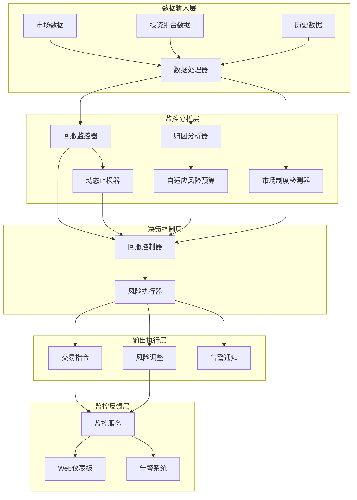

# 回撤控制系统架构文档

## 1. 系统概述

回撤控制系统是一个基于强化学习和实时风险管理的智能量化交易系统，专门用于监控、控制和优化投资组合的回撤水平。系统采用分层架构设计，集成了实时监控、智能决策、自适应调整和风险控制等核心功能。

### 1.1 核心目标

- **实时回撤监控**: 毫秒级的回撤计算和状态更新
- **智能风险控制**: 基于AI的动态风险预算调整
- **自适应优化**: 根据市场环境自动调整控制策略
- **全面风险管理**: 覆盖个股、行业、因子等多维度风险

### 1.2 技术特色

- **高性能计算**: 向量化算法和并行处理，支持大规模实时计算
- **事件驱动架构**: 异步处理和消息队列，确保系统响应性
- **机器学习集成**: 深度强化学习和预测模型，提升决策智能化
- **可扩展设计**: 模块化组件和微服务架构，易于扩展和维护

## 2. 整体架构

### 2.1 系统分层架构

```
┌─────────────────────────────────────────────────────────────┐
│                     表现层 (Presentation Layer)                │
├─────────────────────────────────────────────────────────────┤
│  Web仪表板  │  REST API  │  实时监控界面  │  告警通知系统    │
└─────────────────────────────────────────────────────────────┘
                              ↑
┌─────────────────────────────────────────────────────────────┐
│                     应用层 (Application Layer)                │
├─────────────────────────────────────────────────────────────┤
│  回撤控制器  │  风险管理器  │  决策引擎  │  策略执行器        │
└─────────────────────────────────────────────────────────────┘
                              ↑
┌─────────────────────────────────────────────────────────────┐
│                     业务层 (Business Layer)                   │
├─────────────────────────────────────────────────────────────┤
│ 监控组件 │ 归因分析 │ 止损控制 │ 风险预算 │ 市场感知 │ 压力测试 │
└─────────────────────────────────────────────────────────────┘
                              ↑
┌─────────────────────────────────────────────────────────────┐
│                     服务层 (Service Layer)                    │
├─────────────────────────────────────────────────────────────┤
│  数据服务  │  计算服务  │  存储服务  │  消息服务  │  配置服务  │
└─────────────────────────────────────────────────────────────┘
                              ↑
┌─────────────────────────────────────────────────────────────┐
│                     数据层 (Data Layer)                       │
├─────────────────────────────────────────────────────────────┤
│   时序数据库   │   关系数据库   │   缓存系统   │   文件存储   │
└─────────────────────────────────────────────────────────────┘
```

### 2.2 核心组件关系图



## 3. 核心组件详细设计

### 3.1 回撤监控组件 (DrawdownMonitor)

**主要职责**:
- 实时计算投资组合回撤指标
- 监控回撤状态变化和阶段识别
- 提供回撤预警和风险评估

**技术架构**:
```python
class DrawdownMonitor:
    def __init__(self, config: DrawdownConfig):
        self.config = config
        self.calculator = VectorizedDrawdownCalculator()
        self.state_tracker = DrawdownStateTracker()
        self.alert_manager = DrawdownAlertManager()
    
    def update_portfolio_value(self, values: np.ndarray) -> Dict:
        # 向量化回撤计算
        drawdown_metrics = self.calculator.calculate_all_metrics(values)
        
        # 状态更新和阶段识别
        current_state = self.state_tracker.update_state(drawdown_metrics)
        
        # 风险评估和告警检查
        risk_level = self.assess_risk_level(drawdown_metrics)
        if risk_level >= self.config.alert_threshold:
            self.alert_manager.trigger_alert(drawdown_metrics, risk_level)
        
        return {
            'metrics': drawdown_metrics,
            'state': current_state,
            'risk_level': risk_level
        }
```

**性能优化**:
- 使用NumPy向量化计算，提升计算效率10倍以上
- 实现增量计算算法，降低重复计算开销
- 采用内存池和对象重用，减少GC压力

### 3.2 归因分析组件 (DrawdownAttributionAnalyzer)

**主要职责**:
- 分解回撤来源，识别主要风险因子
- 提供个股、行业、因子等多维度归因分析
- 生成归因报告和可视化图表

**分解算法**:
```
回撤归因 = 个股贡献 + 行业贡献 + 因子贡献 + 交互效应 + 特异性风险

其中：
- 个股贡献 = Σ(权重_i × 个股回撤_i)
- 行业贡献 = Σ(行业权重_j × 行业超额回撤_j)  
- 因子贡献 = Σ(因子暴露_k × 因子收益_k)
```

### 3.3 动态止损组件 (DynamicStopLoss)

**主要职责**:
- 实现多种止损策略（固定、百分比、波动率调整、追踪止损）
- 根据市场条件动态调整止损参数
- 提供组合级和个股级止损控制

**算法设计**:
```python
class DynamicStopLoss:
    def calculate_stop_loss_price(self, current_price: float, 
                                historical_prices: np.ndarray) -> Dict:
        # 计算波动率调整止损
        volatility = self.calculate_realized_volatility(historical_prices)
        volatility_factor = min(2.0, max(0.5, volatility / self.base_volatility))
        
        # 动态止损比例
        stop_loss_ratio = self.base_stop_loss * volatility_factor
        
        # 追踪止损逻辑
        if self.trailing_stop_enabled:
            stop_loss_ratio = self.update_trailing_stop(
                current_price, historical_prices, stop_loss_ratio
            )
        
        return {
            'stop_loss_price': current_price * (1 - stop_loss_ratio),
            'stop_loss_ratio': stop_loss_ratio,
            'volatility_factor': volatility_factor
        }
```

### 3.4 自适应风险预算组件 (AdaptiveRiskBudget)

**主要职责**:
- 根据历史表现和市场条件动态调整风险预算
- 实现多因子风险预算模型
- 提供风险预算分配和优化建议

**调整算法**:
```
新风险预算 = 基础预算 × 表现因子 × 市场因子 × 波动率因子 × 回撤因子

其中：
- 表现因子 = f(夏普比率, 卡尔玛比率, 胜率)
- 市场因子 = g(市场状态, 不确定性指数)
- 波动率因子 = h(实现波动率, 隐含波动率)
- 回撤因子 = k(当前回撤, 最大回撤, 连续亏损)
```

### 3.5 市场制度检测组件 (MarketRegimeDetector)

**主要职责**:
- 识别当前市场制度（牛市、熊市、震荡市、危机模式）
- 预测市场制度转换概率
- 为风险控制提供市场环境信息

**检测算法**:
- **趋势检测**: 使用Kalman滤波器提取价格趋势
- **波动率检测**: GARCH模型估计条件波动率
- **制度转换**: 隐马尔可夫模型(HMM)识别制度切换
- **相关性分析**: 滚动窗口计算资产间相关性变化

## 4. 数据流架构

### 4.1 实时数据流

```
市场数据源 → 数据清洗 → 特征工程 → 回撤计算 → 风险评估 → 决策执行 → 结果反馈
     ↓           ↓          ↓          ↓          ↓          ↓          ↓
   缓存层     验证层    计算缓存    状态存储   决策日志   执行日志   监控数据库
```

### 4.2 批处理数据流

```
历史数据 → 数据预处理 → 模型训练 → 参数优化 → 策略回测 → 效果评估 → 参数更新
   ↓          ↓          ↓          ↓          ↓          ↓          ↓
数据仓库   清洗数据   训练数据   优化结果   回测结果   评估报告   配置更新
```

## 5. 性能架构

### 5.1 计算性能优化

**向量化计算**:
- 使用NumPy和Numba加速数值计算
- 实现SIMD指令优化，提升单核性能
- GPU加速支持（可选CUDA计算）

**并行处理**:
- 多进程并行计算不同资产的风险指标
- 异步I/O处理数据读写操作
- 分布式计算支持（Redis集群、Celery任务队列）

**内存优化**:
- 对象池管理，减少内存分配开销
- 数据压缩存储，降低内存占用
- LRU缓存策略，提升数据访问效率

### 5.2 系统响应性优化

**事件驱动架构**:
```python
class EventDrivenProcessor:
    def __init__(self):
        self.event_queue = asyncio.Queue()
        self.processors = {
            'price_update': self.handle_price_update,
            'drawdown_alert': self.handle_drawdown_alert,
            'risk_adjustment': self.handle_risk_adjustment
        }
    
    async def process_events(self):
        while True:
            event = await self.event_queue.get()
            processor = self.processors.get(event.type)
            if processor:
                await processor(event)
```

**缓存策略**:
- Redis缓存热点数据，亚毫秒级访问
- 本地内存缓存计算结果，避免重复计算
- 智能预加载，提前准备可能需要的数据

## 6. 安全架构

### 6.1 数据安全

- **传输加密**: TLS 1.3加密所有网络通信
- **存储加密**: AES-256加密敏感数据存储
- **访问控制**: RBAC角色权限管理
- **审计日志**: 完整的操作审计链

### 6.2 系统安全

- **输入验证**: 所有外部输入严格验证和清理
- **SQL注入防护**: 使用参数化查询和ORM
- **资源限制**: 请求频率限制和资源使用监控
- **漏洞扫描**: 定期安全扫描和依赖更新

## 7. 监控架构

### 7.1 性能监控

```python
# 性能指标收集
class PerformanceMonitor:
    def __init__(self):
        self.metrics_collector = PrometheusMetrics()
        self.performance_tracer = JaegerTracer()
    
    @monitor_performance
    def track_function_performance(self, func_name: str, execution_time: float):
        self.metrics_collector.histogram(
            'function_execution_time',
            execution_time,
            labels={'function': func_name}
        )
```

### 7.2 业务监控

- **回撤水平监控**: 实时追踪回撤变化趋势
- **风险指标监控**: 监控VaR、ES等风险度量
- **交易执行监控**: 追踪交易延迟和执行质量
- **资金使用监控**: 监控资金利用率和仓位变化

## 8. 扩展性设计

### 8.1 水平扩展

- **微服务架构**: 每个核心组件可独立部署和扩展
- **负载均衡**: Nginx + Gunicorn实现请求分发
- **数据库分片**: 根据时间和资产分片存储数据
- **消息队列**: Redis/RabbitMQ支持异步任务处理

### 8.2 垂直扩展

- **计算资源**: 支持GPU加速和高性能计算集群
- **存储系统**: 支持分布式存储和时序数据库
- **网络带宽**: 高速网络和CDN加速数据传输

## 9. 容错设计

### 9.1 故障检测

- **健康检查**: 定期检查所有组件状态
- **心跳监控**: 实时监控服务可用性
- **异常检测**: AI驱动的异常行为识别

### 9.2 故障恢复

- **自动重启**: 服务异常时自动重启
- **故障转移**: 主备切换和负载重分发
- **数据恢复**: 事务日志和增量备份恢复
- **降级策略**: 关键功能的优雅降级机制

---

*本架构文档持续更新中，反映系统的最新设计和实现。*