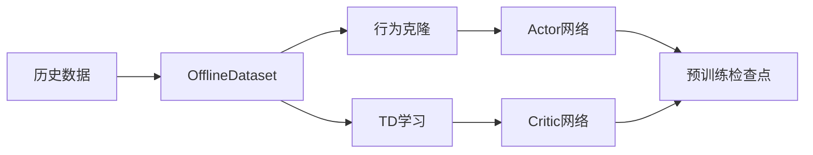
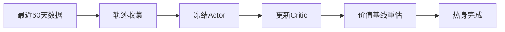
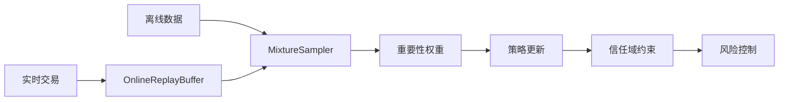

# O2O强化学习使用指南

## 概述

离线到在线(Offline-to-Online, O2O)强化学习是一种先进的训练范式，通过结合历史数据的离线预训练和实时市场数据的在线微调来解决市场分布漂移问题。本指南将详细介绍如何在量化交易系统中使用O2O功能。

## 核心概念

### 三阶段训练流程

O2O训练包含三个连续的阶段：

1. **离线预训练阶段**：使用历史数据进行大规模预训练
2. **热身微调阶段**：使用最近数据快速适应当前市场
3. **在线学习阶段**：持续学习实时交易数据

### 关键组件

- **OfflineDataset**：管理历史数据，支持Qlib数据转换
- **OnlineReplayBuffer**：存储实时交易轨迹，支持优先级采样
- **MixtureSampler**：智能混合离线和在线数据
- **ValueDriftMonitor**：监控市场分布漂移
- **O2OTrainingCoordinator**：协调整个训练流程

## 快速开始

### 1. 环境准备

确保已安装所有依赖：

```bash
pip install -r requirements.txt
```

### 2. 基本配置

创建O2O配置文件：

```python
from config.config_manager import ConfigManager

config = {
    'o2o': {
        # 离线预训练参数
        'offline_epochs': 100,
        'behavior_cloning_weight': 0.5,
        'td_learning_weight': 0.5,
        
        # 热身微调参数
        'warmup_days': 60,
        'warmup_epochs': 20,
        'critic_only_updates': True,
        
        # 在线学习参数
        'initial_rho': 0.2,
        'rho_increment': 0.01,
        'trust_region_beta': 1.0,
        'beta_decay': 0.99,
        
        # 漂移检测参数
        'kl_threshold': 0.1,
        'sharpe_drop_threshold': 0.2,
        'cvar_breach_threshold': -0.02
    }
}
```

### 3. 启动O2O训练

```python
from trainer.o2o_coordinator import O2OTrainingCoordinator
from rl_agent.cvar_ppo_agent import EnhancedCVaRPPOAgent
from rl_agent.trading_environment import EnhancedTradingEnvironment

# 初始化组件
agent = EnhancedCVaRPPOAgent(state_dim=50, action_dim=10, config=config)
env = EnhancedTradingEnvironment(factor_data, price_data, config)
coordinator = O2OTrainingCoordinator(agent, env, config)

# 开始训练
coordinator.run_full_training()
```

## 详细配置参数

### 离线预训练参数

| 参数名 | 类型 | 默认值 | 说明 |
|--------|------|--------|------|
| `offline_epochs` | int | 100 | 离线预训练轮数 |
| `behavior_cloning_weight` | float | 0.5 | 行为克隆损失权重 |
| `td_learning_weight` | float | 0.5 | TD学习损失权重 |
| `offline_batch_size` | int | 256 | 离线训练批次大小 |
| `offline_lr` | float | 3e-4 | 离线训练学习率 |

**推荐设置**：
- 对于数据质量较高的历史数据，增加`behavior_cloning_weight`
- 对于噪声较多的数据，增加`td_learning_weight`
- 大数据集可适当增加`offline_batch_size`

### 热身微调参数

| 参数名 | 类型 | 默认值 | 说明 |
|--------|------|--------|------|
| `warmup_days` | int | 60 | 热身数据天数 |
| `warmup_epochs` | int | 20 | 热身训练轮数 |
| `critic_only_updates` | bool | True | 是否仅更新Critic |
| `warmup_lr` | float | 1e-4 | 热身学习率 |
| `convergence_threshold` | float | 0.01 | 收敛阈值 |

**推荐设置**：
- 市场波动较大时，增加`warmup_days`到90天
- 对于稳定市场，可减少`warmup_epochs`到10轮
- 初期建议保持`critic_only_updates=True`

### 在线学习参数

| 参数名 | 类型 | 默认值 | 说明 |
|--------|------|--------|------|
| `initial_rho` | float | 0.2 | 初始在线采样比例 |
| `rho_increment` | float | 0.01 | 采样比例增长率 |
| `trust_region_beta` | float | 1.0 | 信任域约束强度 |
| `beta_decay` | float | 0.99 | 信任域衰减率 |
| `online_buffer_size` | int | 10000 | 在线缓冲区大小 |

**推荐设置**：
- 保守策略：`initial_rho=0.1, rho_increment=0.005`
- 激进策略：`initial_rho=0.3, rho_increment=0.02`
- 高波动市场：增加`trust_region_beta`到2.0

### 漂移检测参数

| 参数名 | 类型 | 默认值 | 说明 |
|--------|------|--------|------|
| `kl_threshold` | float | 0.1 | KL散度阈值 |
| `sharpe_drop_threshold` | float | 0.2 | 夏普率下降阈值 |
| `cvar_breach_threshold` | float | -0.02 | CVaR突破阈值 |
| `drift_window` | int | 30 | 漂移检测窗口 |

**推荐设置**：
- 敏感检测：`kl_threshold=0.05`
- 稳健检测：`kl_threshold=0.15`
- 高风险容忍：`cvar_breach_threshold=-0.05`

## 训练流程详解

### 阶段1：离线预训练



**目标**：使用大量历史数据初始化智能体，学习基本的交易策略

**关键步骤**：
1. 加载历史因子和价格数据
2. 创建行为克隆数据集
3. 同时训练Actor和Critic网络
4. 保存预训练检查点

**监控指标**：
- 行为克隆损失下降
- TD误差收敛
- 策略熵保持合理水平

### 阶段2：热身微调



**目标**：使用最近市场数据快速适应当前环境

**关键步骤**：
1. 收集最近60天交易轨迹
2. 冻结Actor参数，仅更新Critic
3. 重新估计价值函数基线
4. 检测收敛或失败回退

**监控指标**：
- Critic损失收敛
- 价值估计准确性
- 与离线模型的差异

### 阶段3：在线学习



**目标**：持续学习实时数据，保持策略适应性

**关键步骤**：
1. 收集实时交易轨迹
2. 动态混合离线和在线样本
3. 应用重要性权重纠正分布偏差
4. 使用信任域约束防止策略发散

**监控指标**：
- 采样比例ρ(t)演化
- KL散度变化
- 交易性能指标

## 使用示例

### 基础使用

```python
import pandas as pd
from trainer.o2o_coordinator import O2OTrainingCoordinator
from rl_agent.cvar_ppo_agent import EnhancedCVaRPPOAgent
from rl_agent.trading_environment import EnhancedTradingEnvironment
from data.data_manager import DataManager

# 1. 准备数据
data_manager = DataManager()
factor_data = data_manager.load_factor_data('2020-01-01', '2023-12-31')
price_data = data_manager.load_price_data('2020-01-01', '2023-12-31')

# 2. 创建配置
config = {
    'o2o': {
        'offline_epochs': 50,
        'warmup_days': 30,
        'initial_rho': 0.15
    },
    'agent': {
        'cvar_alpha': 0.05,
        'risk_lambda': 1.0
    }
}

# 3. 初始化组件
agent = EnhancedCVaRPPOAgent(
    state_dim=factor_data.shape[1], 
    action_dim=100, 
    config=config
)

env = EnhancedTradingEnvironment(
    factor_data=factor_data,
    price_data=price_data,
    config=config
)

# 4. 创建协调器并开始训练
coordinator = O2OTrainingCoordinator(agent, env, config)
training_results = coordinator.run_full_training()

print(f"训练完成，最终性能: {training_results['final_performance']}")
```

### 高级使用：自定义监控

```python
from monitoring.value_drift_monitor import ValueDriftMonitor

# 创建自定义漂移监控器
drift_monitor = ValueDriftMonitor(config={
    'kl_threshold': 0.08,
    'sharpe_window': 20,
    'cvar_window': 5
})

# 集成到协调器
coordinator = O2OTrainingCoordinator(
    agent=agent, 
    env=env, 
    config=config,
    drift_monitor=drift_monitor
)

# 添加自定义回调
def on_drift_detected(drift_info):
    print(f"检测到分布漂移: {drift_info}")
    # 自定义处理逻辑

coordinator.add_drift_callback(on_drift_detected)
coordinator.run_full_training()
```

### 分阶段训练

```python
# 仅执行离线预训练
coordinator.run_offline_pretraining()
print("离线预训练完成")

# 执行热身微调
coordinator.run_warmup_finetuning()
print("热身微调完成")

# 开始在线学习
coordinator.start_online_learning()
print("在线学习启动")
```

## 性能监控

### 关键指标

1. **训练效率指标**
   - 每轮训练时间
   - 样本利用效率
   - 内存使用情况

2. **学习效果指标**
   - 累积收益率
   - 夏普比率
   - 最大回撤
   - CVaR风险指标

3. **适应性指标**
   - KL散度变化
   - 策略熵演化
   - 价值函数稳定性

### 监控工具

```python
from monitoring.o2o_monitor import O2OMonitor

# 创建监控器
monitor = O2OMonitor(config)

# 启动实时监控
monitor.start_monitoring(coordinator)

# 获取监控报告
report = monitor.generate_report()
print(report.summary())
```

## 故障排除指南

### 常见问题及解决方案

#### 1. 离线预训练不收敛

**症状**：
- 损失函数不下降或震荡
- 策略输出异常
- 训练时间过长

**可能原因**：
- 学习率过高或过低
- 数据质量问题
- 网络结构不合适

**解决方案**：
```python
# 调整学习率
config['o2o']['offline_lr'] = 1e-4  # 降低学习率

# 增加数据清洗
config['data']['apply_cleaning'] = True
config['data']['outlier_threshold'] = 3.0

# 调整网络结构
config['agent']['hidden_dims'] = [256, 128, 64]
```

#### 2. 热身微调失败

**症状**：
- Critic损失不收敛
- 价值估计偏差过大
- 频繁触发回退机制

**可能原因**：
- 热身数据不足
- 市场制度变化过大
- 学习率设置不当

**解决方案**：
```python
# 增加热身数据
config['o2o']['warmup_days'] = 90

# 降低学习率
config['o2o']['warmup_lr'] = 5e-5

# 调整收敛阈值
config['o2o']['convergence_threshold'] = 0.02
```

#### 3. 在线学习不稳定

**症状**：
- 策略发散
- 性能急剧下降
- KL散度过大

**可能原因**：
- 信任域约束过松
- 采样比例增长过快
- 重要性权重计算错误

**解决方案**：
```python
# 加强信任域约束
config['o2o']['trust_region_beta'] = 2.0
config['o2o']['beta_decay'] = 0.95

# 减缓采样比例增长
config['o2o']['rho_increment'] = 0.005

# 检查重要性权重
config['o2o']['importance_weight_clip'] = 10.0
```

#### 4. 分布漂移检测过敏

**症状**：
- 频繁触发重训练
- 训练不稳定
- 计算资源浪费

**可能原因**：
- 检测阈值过低
- 检测窗口过小
- 市场噪声影响

**解决方案**：
```python
# 调整检测阈值
config['o2o']['kl_threshold'] = 0.15
config['o2o']['sharpe_drop_threshold'] = 0.3

# 增加检测窗口
config['o2o']['drift_window'] = 50

# 添加噪声过滤
config['o2o']['noise_filter'] = True
```

### 调试工具

#### 1. 日志分析

```python
from utils.logger import setup_logger

# 启用详细日志
logger = setup_logger('o2o_debug', level='DEBUG')

# 分析训练日志
from tools.log_analyzer import LogAnalyzer
analyzer = LogAnalyzer('logs/o2o_training.log')
analyzer.analyze_convergence()
analyzer.plot_metrics()
```

#### 2. 性能分析

```python
from tools.performance_profiler import O2OProfiler

# 创建性能分析器
profiler = O2OProfiler()

# 分析训练性能
with profiler:
    coordinator.run_full_training()

# 生成报告
profiler.generate_report('performance_report.html')
```

#### 3. 数据质量检查

```python
from tools.data_validator import DataValidator

# 验证数据质量
validator = DataValidator()
quality_report = validator.validate_training_data(
    factor_data, price_data
)

if not quality_report.is_valid:
    print("数据质量问题:")
    for issue in quality_report.issues:
        print(f"- {issue}")
```

## 最佳实践

### 1. 数据准备

- **数据质量**：确保历史数据完整、准确，无明显异常值
- **数据范围**：建议使用至少2年的历史数据进行离线预训练
- **数据更新**：定期更新历史数据，保持数据的时效性

### 2. 参数调优

- **渐进调优**：从保守参数开始，逐步调整到最优设置
- **A/B测试**：对比不同参数设置的效果
- **交叉验证**：使用时间序列交叉验证评估参数稳定性

### 3. 风险控制

- **分阶段部署**：先在模拟环境测试，再逐步部署到实盘
- **监控预警**：设置完善的监控和预警机制
- **应急预案**：准备策略回退和紧急停止机制

### 4. 性能优化

- **内存管理**：合理设置缓冲区大小，避免内存溢出
- **计算优化**：利用GPU加速训练，使用批处理提高效率
- **并行处理**：在条件允许时使用多进程并行训练

## 进阶主题

### 1. 自定义组件

```python
from data.offline_dataset import OfflineDataset

class CustomOfflineDataset(OfflineDataset):
    def __init__(self, config):
        super().__init__(config)
        
    def custom_data_processing(self, data):
        # 自定义数据处理逻辑
        return processed_data
```

### 2. 集成外部数据源

```python
from data.external_data_provider import ExternalDataProvider

# 集成新闻情感数据
sentiment_provider = ExternalDataProvider('sentiment')
coordinator.add_data_source(sentiment_provider)
```

### 3. 多智能体协作

```python
from trainer.multi_agent_coordinator import MultiAgentCoordinator

# 创建多智能体系统
agents = [agent1, agent2, agent3]
multi_coordinator = MultiAgentCoordinator(agents, env, config)
multi_coordinator.run_collaborative_training()
```

## 总结

O2O强化学习为量化交易提供了一个强大而灵活的框架，能够有效应对市场分布漂移问题。通过合理的配置和监控，可以显著提高交易策略的适应性和稳定性。

关键成功因素：
1. 高质量的历史数据
2. 合理的参数设置
3. 完善的监控机制
4. 及时的风险控制

建议在实际使用中：
1. 从简单配置开始
2. 逐步优化参数
3. 持续监控性能
4. 定期评估效果

如有问题，请参考故障排除指南或联系技术支持。