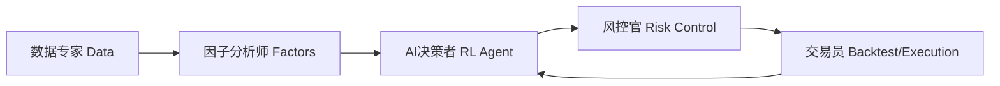

# 基础概念介绍

欢迎来到A股强化学习量化交易系统！在您深入了解各项功能之前，理解本系统背后的一些核心概念至关重要。本教程将为您解释系统架构、关键术语和投资策略的基本原理。

## 1. 系统是如何工作的？

您可以将本系统想象成一个由多个专家组成的团队，协同为您管理投资。

1.  **数据专家 (Data)**: 负责从市场获取所有原始数据（如股价、成交量），并进行清洗和整理。
2.  **因子分析师 (Factors)**: 对数据进行深度加工，计算出能够预测股票未来表现的“因子”（如动量、估值）。
3.  **AI决策者 (RL Agent)**: 这是系统的核心大脑，一个强化学习智能体。它观察因子分析师的报告和当前市场情况，做出买入或卖出哪些股票的决策，目标是实现长期稳健收益。
4.  **风控官 (Risk Control)**: 在AI决策者做出决定后，风控官会进行严格审查，确保这个决策没有违反任何风险规定（如“单只股票不能买太多”）。
5.  **交易员 (Backtest/Execution)**: 最后，交易员负责执行经过风控审查的交易决策，并记录结果。在回测模式下，它模拟交易；在实盘中，它连接到券商接口。

## 2. 核心术语解释

### 强化学习 (Reinforcement Learning, RL)
一种机器学习方法，智能体(Agent)通过与环境(Environment)的互动来学习。它通过“试错”来寻找最佳行为策略，其目标是最大化累积的“奖励”(Reward)。在我们的系统中，智能体是交易决策者，环境是股票市场。

### CVaR-PPO
我们使用的核心强化学习算法。它不仅仅追求高收益，更重要的是**控制极端亏损的风险**。PPO是一种稳定、先进的RL算法，我们对其进行了改造，加入了CVaR（条件风险价值）作为风险约束。简单来说，它是一个“既聪明又谨慎”的AI交易员。

### 因子 (Factor)
可以解释或预测资产收益和风险的数值特征。
-   **Alpha因子**: 旨在预测股票的超额收益。例如，“动量因子”认为过去涨得好的股票未来一段时间内可能继续上涨。
-   **风险因子**: 旨在度量股票的风险暴露。例如，“波动率因子”衡量一只股票价格波动的剧烈程度。

### O2O (Offline-to-Online)
一种先进的训练模式，意为“离线到在线”。由于金融市场是不断变化的，只用历史数据训练出的模型可能很快失效。O2O框架让模型能够：
1.  **离线(Offline)**: 用多年的历史数据进行充分的“基础学习”。
2.  **在线(Online)**: 在最近的市场数据上进行“适应性微调”，并能在真实交易中持续学习。
这大大增强了模型的适应性。

### 回测 (Backtest)
在历史数据上模拟执行交易策略，以评估其历史表现。这是检验策略是否有效的重要手段。回测会生成年化收益率、最大回撤等关键绩效指标。

### 最大回撤 (Max Drawdown)
衡量策略可能出现的最大亏损。它是从一个历史高点到之后的低点的最大跌幅。例如，最大回撤10%意味着在最糟糕的情况下，你的账户净值从最高点下跌了10%。**这是我们系统最关注的风险指标之一。**

## 3. 投资策略原理

本系统的核心投资哲学是“风险优先，稳健增值”。

-   **目标不是一夜暴富**: 我们不追求短期的高额利润，因为这通常伴随着巨大的风险。
-   **追求长期稳健**: 我们的目标是在严格控制回撤（亏损）的前提下，实现超越市场基准的长期稳定回报。
-   **优化投资体验**: 通过控制波动和回撤，我们旨在提供一个更“舒适”的投资体验，避免投资者因市场剧烈波动而产生焦虑。

现在您已经了解了本系统的基本概念，可以继续学习 [数据管理教程](data_tutorial.md) 或 [回测分析教程](backtest_tutorial.md) 来进行更深入的实践了。
