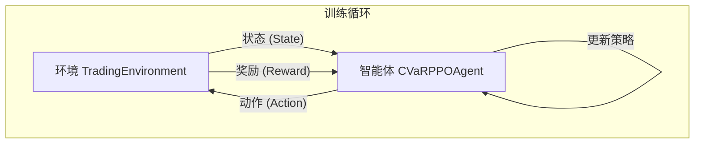

# 强化学习教程

本教程将深入介绍如何使用本系统的强化学习模块，包括设置交易环境、训练CVaR-PPO智能体以及模型调优的关键技巧。

## 1. 理解RL模块的协同工作

强化学习流程主要涉及两个核心组件的交互：

-   **`TradingEnvironment`**: 扮演“市场”的角色。它提供市场状态，执行智能体的交易决策，并返回结果（收益和奖励）。
-   **`CVaRPPOAgent`**: 扮演“交易员”的角色。它观察环境提供的状态，做出决策（即给出投资组合权重），并根据环境反馈的奖励来学习和进化。



## 2. 交易环境设置 (`TradingEnvironment`)

交易环境的配置是训练成功的第一步。您需要在配置文件中定义环境的行为。

**示例配置 (`config.yaml`):**
```yaml
env:
  lookback_window: 20       # 状态中包含过去多少天的数据
  transaction_cost: 0.001   # 交易成本（双边）
  max_position: 0.1         # 单只股票的最大仓位
  max_leverage: 1.2         # 总杠杆限制

  # 奖励函数塑形参数
  lambda1: 2.0              # 回撤惩罚系数
  lambda2: 1.0              # CVaR惩罚系数
  max_dd_threshold: 0.05    # 回撤惩罚的激活阈值
```

**代码实现:**
```python
from rl_agent.trading_environment import TradingEnvironment
from data.data_manager import DataManager

# 假设 data_manager 和 config 已初始化
factor_data = data_manager.get_factor_data(...)
price_data = data_manager.get_price_data(...)

env_config = config.get_config('env')
env = TradingEnvironment(factor_data, price_data, env_config)
```

## 3. 智能体训练 (`CVaRPPOAgent`)

智能体的训练是一个迭代过程。在每个`episode`（一个完整的历史回测周期）结束后，使用收集到的数据进行学习。

**示例配置 (`config.yaml`):**
```yaml
agent:
  # 网络结构
  hidden_dim: 256

  # PPO 核心参数
  learning_rate: 3.0e-4
  clip_epsilon: 0.2
  ppo_epochs: 10
  batch_size: 64

  # CVaR 风险约束
  cvar_alpha: 0.05
  cvar_lambda: 1.0
  cvar_threshold: -0.02
```

**训练循环伪代码:**
```python
from rl_agent.cvar_ppo_agent import CVaRPPOAgent

agent_config = config.get_config('agent')
agent = CVaRPPOAgent(
    state_dim=env.observation_space.shape[0],
    action_dim=env.action_space.shape[0],
    config=agent_config
)

for episode in range(num_episodes):
    state, _ = env.reset()
    done = False
    while not done:
        # 1. 智能体决策
        action, log_prob, value, cvar_est = agent.get_action(state)

        # 2. 环境执行
        next_state, reward, terminated, truncated, info = env.step(action)
        done = terminated or truncated

        # 3. 存储经验
        agent.store_transition(state, action, reward, value, log_prob, done, cvar_est)

        state = next_state

    # 4. 学习更新
    training_stats = agent.update()
    print(f"Episode {episode} finished. Loss: {training_stats['total_loss']:.4f}")

# 保存训练好的模型
agent.save_model("my_best_agent.pth")
```

## 4. 模型调优技巧

强化学习的调优具有挑战性，以下是一些关键技巧：

### 学习率 (learning_rate)
-   **过高**: 训练不稳定，损失函数剧烈震荡。
-   **过低**: 训练速度过慢，可能无法收敛。
-   **建议**: 从`1e-4`到`5e-4`开始尝试。对于O2O训练，可以为Actor和Critic设置不同的学习率（`actor_lr`, `critic_lr`），通常Critic的学习率可以稍高一些。

### CVaR参数 (`cvar_alpha`, `cvar_lambda`, `cvar_threshold`)
-   `cvar_alpha`: 定义了我们关注的风险分位数。`0.05`表示我们关注最差的5%的情况。
-   `cvar_lambda`: CVaR损失在总损失中的权重。值越大，模型越厌恶风险。
-   `cvar_threshold`: 你能容忍的最大CVaR。例如`-0.02`表示在最差的5%情况下，平均亏损不能超过2%。
-   **建议**: 优先调整`cvar_lambda`和`cvar_threshold`来平衡风险和收益。

### PPO Epochs 和 Batch Size
-   `ppo_epochs`: 在一次数据收集后，对这些数据进行学习的轮数。
-   `batch_size`: 每次学习更新时使用的数据量。
-   **建议**: `ppo_epochs`通常在5-15之间。`batch_size`可以根据你的硬件资源（特别是显存）来设置，通常为64, 128, 256。

### 奖励函数塑形 (Reward Shaping)
奖励函数的设计对最终结果至关重要。你可以通过调整`env`配置中的`lambda1`（回撤惩罚）和`lambda2`（CVaR惩罚）来改变智能体的行为偏好。
-   **增加`lambda1`**: 使智能体更厌恶净值的回撤。
-   **增加`lambda2`**: 使智能体更关注尾部风险。

## 5. O2O训练流程

对于更高级的应用，系统支持O2O（离线到在线）训练。这通常由`O2OTrainingCoordinator`来协调，但其核心步骤涉及本模块：

1.  **离线预训练**: 使用`agent.update()`在大量历史数据上进行训练。
2.  **热身微调**: 
    -   调用`agent.split_optimizers()`来分离Actor和Critic的优化器。
    -   调用`agent.freeze_actor()`来冻结策略网络。
    -   仅使用近期的市场数据进行训练，此时只有价值网络（Critic）被更新。
3.  **在线学习**: 
    -   调用`agent.unfreeze_actor()`解冻策略网络。
    -   使用`agent.update_with_importance_weights()`方法，传入从在线数据和离线数据混合采样计算出的重要性权重，持续微调模型。

本教程提供了强化学习模块的核心使用方法。要了解这些组件如何被更高层的模块（如`trainer`）协调，请参考O2O使用指南和相关示例代码。
